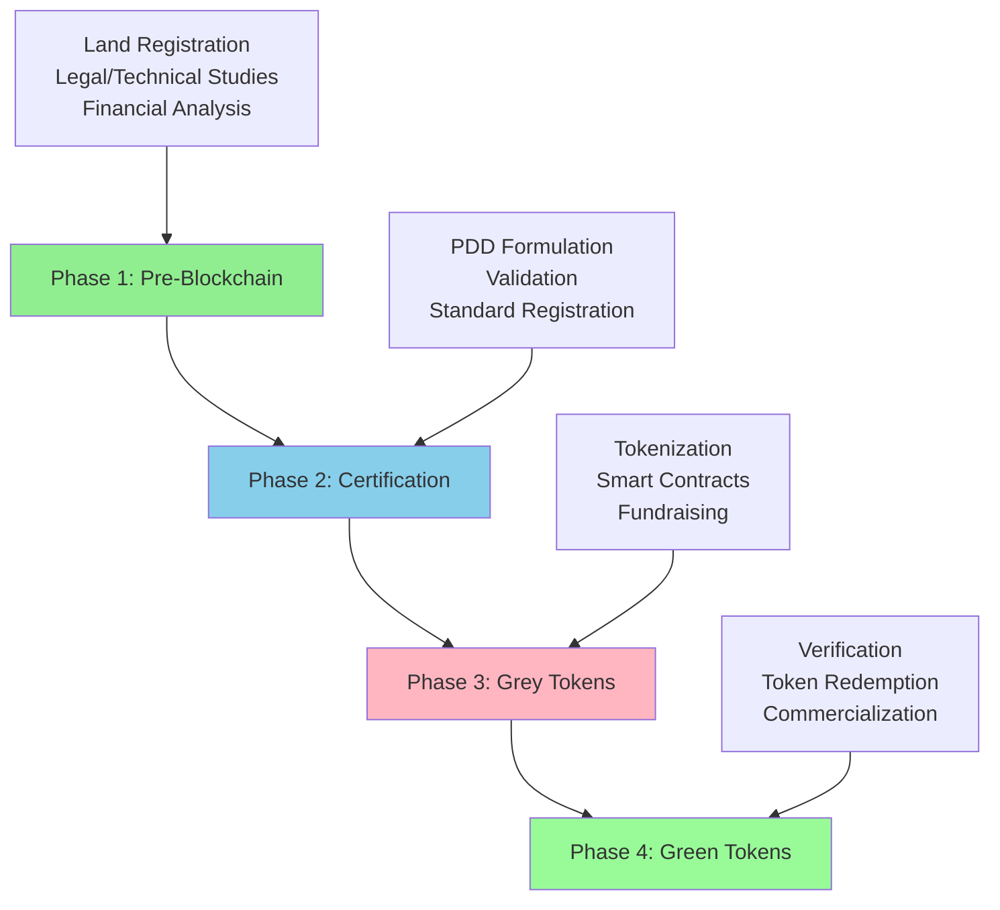
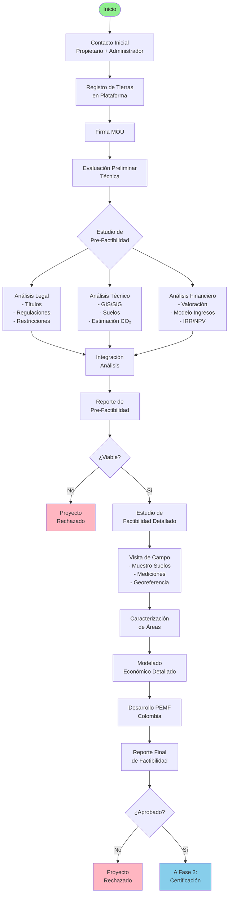
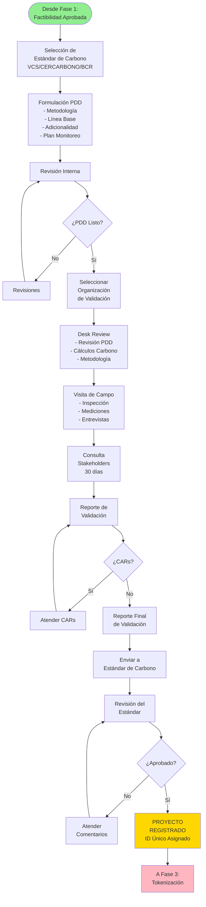

# Business Process Overview

## Introduction

The Terrasacha platform facilitates the complete lifecycle of carbon credit projects—from initial land evaluation through tokenization and final commercialization. This comprehensive workflow integrates traditional carbon market processes with blockchain technology to create transparent, tradeable digital assets representing verified carbon credits.

The process spans **four major phases**, beginning with extensive pre-blockchain activities (legal, technical, and financial due diligence) before transitioning to on-chain tokenization and trading.

## Complete Workflow

## The Four Phases

### Phase 1: Pre-Blockchain (Registry & Studies)
**Duration:** 6-18 months
**What Happens:** Before any blockchain technology is involved, extensive due diligence is performed on potential carbon credit projects. This includes land registration, legal title verification, technical GIS analysis, financial modeling, and feasibility studies.

**Key Activities:**
- Initial contact and MOU signing
- Pre-feasibility study (legal, technical, financial)
- Detailed feasibility study with field visits
- Soil and forestry analysis

**Outcome:** Determination of project viability and readiness for PDD formulation

[Learn more about Phase 1 →](phase1-pre-blockchain.md)

---

### Phase 2: Certification (PDD & Validation)
**Duration:** 3-6 months
**What Happens:** The project design document (PDD) is formulated according to a chosen carbon standard (VCS, CERCARBONO, BCR, etc.), then validated by an accredited third-party organization, and finally registered with the carbon standard body.

**Key Activities:**
- Carbon standard selection
- PDD document creation
- External validation audit
- Standard registration

**Outcome:** Registered carbon credit project with estimated credit projections

[Learn more about Phase 2 →](phase2-certification.md)

---

### Phase 3: Grey Tokens (Tokenization & Fundraising)
**Duration:** 2-4 months for setup, ongoing for fundraising
**What Happens:** The project enters the blockchain phase. Smart contracts are deployed, and grey tokens are minted representing estimated (not yet certified) carbon credits. These tokens are distributed among stakeholders and sold to investors for project funding.

**Key Activities:**
- Administrator and contract account setup
- Smart contract deployment
- Grey token minting (1 token = 1 estimated ton CO₂eq)
- Token distribution to stakeholders
- Investor fundraising through token sales
- Fiduciary fund management

**Outcome:** Project funded, grey tokens in circulation, execution can begin

[Learn more about Phase 3 →](phase3-grey-tokens.md)

---

### Phase 4: Green Tokens (Verification & Trading)
**Duration:** Ongoing in 5-year verification periods
**What Happens:** As the project executes and captures/reduces carbon, monitoring data is collected. Every verification period (typically 5 years), actual results are verified by third parties and certified credits are issued. Grey token holders can redeem them for green tokens representing certified credits, which can then be traded in carbon markets.

**Key Activities:**
- Continuous monitoring (IoT, satellites, field visits)
- Periodic verification (every 5 years)
- Certification by carbon standard
- Grey to green token redemption
- Buffer management
- Carbon credit commercialization (local, voluntary, international markets)

**Outcome:** Certified carbon credits as tradeable digital assets

[Learn more about Phase 4 →](phase4-green-tokens.md)

---

## Visual Process Diagrams

Below are detailed workflow diagrams for each phase:

### Phase 1: Platform Registry

*Complete registration and pre-feasibility study workflow*

### Phase 2: Platform Certification

*PDD formulation, validation, and standard registration process*

### Phase 3: Marketplace Grey Tokens

```mermaid
flowchart TD
    FromPhase2([Desde Fase 2:<br/>Proyecto Registrado]) --> EarlyEst{Estimación Temprana<br/>Análisis Datos/Imágenes<br/>Puede iniciar antes<br/>de certificación}

    EarlyEst --> TokenDecision[Decisión de<br/>Tokenización<br/>Propietario]

    TokenDecision --> Accept{¿Acepta<br/>Términos?}
    Accept -->|No| Traditional[Financiamiento<br/>Tradicional]
    Accept -->|Sí| AdminSetup[Configuración Cuentas<br/>Administrador<br/>Cardano Wallets]

    AdminSetup --> SmartContracts[Despliegue de<br/>Contratos Inteligentes<br/>OpShin/Cardano]

    SmartContracts --> ContractList[Contratos:<br/>- Genesis Minting<br/>- Investor<br/>- Admin<br/>- Owner<br/>- Community<br/>- Certifier<br/>- Buffer<br/>- Swap]

    ContractList --> TokenDist[Configuración<br/>Distribución]

    TokenDist --> DistTable[Ejemplo Distribución:<br/>Inversionistas: 33.60%<br/>Buffer: 25.62%<br/>Certifier: 13.59%<br/>Propietario: 13.22%<br/>Admin: 12.35%<br/>Comunidad: 1.61%]

    DistTable --> GreyMint[Acuñación<br/>Tokens Grises<br/>1 token = 1 ton CO₂eq estimada]

    GreyMint --> DistTokens[Distribución a<br/>Contratos de Stakeholders]

    DistTokens --> Marketplace[Lanzamiento<br/>Marketplace]

    Marketplace --> InvestPlans[Planes de Inversión:<br/>- Early Bird<br/>- Standard<br/>- Flexible<br/>Diferentes precios/lock-ups]

    InvestPlans --> Fundraising[RECAUDACIÓN<br/>Venta Tokens Grises<br/>a Inversionistas]

    Fundraising --> P2P[Mercado P2P<br/>Trading Secundario]

    P2P --> FinClosure[Cierre Financiero<br/>Capital Recaudado]

    FinClosure --> Fiduciary[Cuenta Fiduciaria<br/>Gestión de Fondos]

    Fiduciary --> ProjectExec[EJECUCIÓN<br/>DEL PROYECTO<br/>Capital disponible]

    ProjectExec --> ToPhase4[A Fase 4:<br/>Monitoreo y<br/>Verificación]

    style FromPhase2 fill:#87CEEB
    style GreyMint fill:#FFD700
    style ToPhase4 fill:#98FB98
    style Traditional fill:#D3D3D3
```

*Tokenization, smart contract deployment, and fundraising workflow*

### Phase 4: Marketplace Green Tokens

```mermaid
flowchart TD
    FromPhase3([Desde Fase 3:<br/>Proyecto en Ejecución]) --> Implementation[Implementación:<br/>- Plantación/Conservación<br/>- Infraestructura<br/>- Actividades de Proyecto]

    Implementation --> MonitorDeploy[Despliegue Sistema<br/>de Monitoreo]

    MonitorDeploy --> MonSystems[Sistemas:<br/>- IoT Sensors<br/>- Imágenes Satelitales<br/>- Mediciones Campo]

    MonSystems --> ContMon[Monitoreo Continuo<br/>Años 1-5]

    ContMon --> Period{Fin de Período?<br/>Típicamente 5 años}
    Period -->|No| ContMon
    Period -->|Sí| MonReport[Preparación<br/>Reporte de Monitoreo<br/>Cálculo CO₂ Real]

    MonReport --> CalcActual[Cálculo Créditos Reales:<br/>Biomasa medida<br/>- Fuga 15%<br/>- Incertidumbre 10%<br/>= Créditos Verificables]

    CalcActual --> SelectVerif[Seleccionar<br/>Organización<br/>de Verificación]

    SelectVerif --> VerifDesk[Desk Review<br/>Verificador]

    VerifDesk --> VerifSite[Visita de Campo<br/>Verificación]

    VerifSite --> VerifReport[Reporte de<br/>Verificación<br/>Créditos Confirmados]

    VerifReport --> StdCert[Estándar Emite<br/>Certificados CER<br/>IDs Únicos]

    StdCert --> CompareEst{Comparar:<br/>Estimado vs Real}

    CompareEst -->|Real < Est| UseBuffer[Usar Buffer Pool<br/>Cubrir déficit]
    CompareEst -->|Real = Est| ReleaseBuffer[Liberar Buffer<br/>a Stakeholders]
    CompareEst -->|Real > Est| Premium[Redención Premium<br/>Surplus distribuido]

    UseBuffer --> MintGreen[Acuñar Tokens Verdes<br/>SUANCO2]
    ReleaseBuffer --> MintGreen
    Premium --> MintGreen

    MintGreen --> LinkCerts[Vincular Certificados<br/>a Tokens<br/>Metadata On-Chain]

    LinkCerts --> Redemption[REDENCIÓN<br/>Tokens Grises → Verdes<br/>1:1 por período]

    Redemption --> InvestorSwap[Inversionistas<br/>Canjean Grises<br/>por Verdes]

    InvestorSwap --> Markets[COMERCIALIZACIÓN<br/>Tokens Verdes]

    Markets --> Local[Mercado Local<br/>Impuesto Carbono CO<br/>~$6-7/ton]
    Markets --> Voluntary[Mercado Voluntario<br/>Corporaciones<br/>$12-25/ton]
    Markets --> International[Mercados<br/>Internacionales<br/>$30-100+/ton]

    Local --> Retirement[Retiro de Tokens<br/>Reclamar Offset]
    Voluntary --> Retirement
    International --> Retirement

    Retirement --> MorePeriods{¿Más Períodos?}
    MorePeriods -->|Sí| ContMon2[Continuar Monitoreo<br/>Próximo Período 5 años]
    ContMon2 --> Period
    MorePeriods -->|No| ProjectComplete[Proyecto Completo<br/>Buffer Final Distribuido]

    style FromPhase3 fill:#FFB6C1
    style MintGreen fill:#FFD700
    style Redemption fill:#90EE90
    style ProjectComplete fill:#87CEEB
```

*Verification, certification, redemption, and commercialization workflow*

---

## Key Stakeholders

The complete process involves numerous actors across different phases:

### Pre-Blockchain Phase
- **Property Owners** - Provide land as collateral for carbon projects
- **Administrator (SUAN)** - Platform operator and process coordinator
- **Legal Team** - Title verification, regulatory compliance
- **Technical Team** - Forestry, GIS, and environmental analysis
- **Financial Team** - Economic modeling and investment planning
- **Social Team** - Community relations and impact assessment
- **Validation Organizations** - ISO-accredited third-party auditors
- **Carbon Standards** - VCS, CERCARBONO, BCR, Gold Standard, ColCx

### Blockchain Phase
- **Investors** - Purchase grey tokens to fund projects
- **Smart Contracts** - Autonomous fund administrators
- **Community** - Local stakeholders receiving benefits
- **Certifiers** - Organizations receiving token allocations

### Commercialization Phase
- **Verification Organizations** - Third-party auditors for actual results
- **Carbon Credit Buyers** - Corporations, governments, individuals
- **Carbon Traders** - Market intermediaries
- **Regulatory Bodies** - Tax authorities, compliance entities

[View detailed stakeholder matrix →](../../reference/stakeholders.md)

---

## Timeline Overview

A typical carbon credit project follows this timeline:

| Phase | Typical Duration | Key Milestone |
|-------|-----------------|---------------|
| **Phase 1** | 6-18 months | Feasibility Report Approved |
| **Phase 2** | 3-6 months | Project Registered with Standard |
| **Phase 3** | 2-4 months | Grey Tokens Minted & Distributed |
| **Ongoing** | 20-30 years | Project Execution |
| **Phase 4 (Period 1)** | 5 years | First Verification & Certification |
| **Phase 4 (Period 2)** | 5 years | Second Verification & Certification |
| **Phase 4 (Period N)** | 5 years each | Subsequent Verification Periods |

**Total Pre-Blockchain Time:** ~9-24 months
**Time to Token Launch:** ~11-26 months
**First Green Tokens:** ~5 years after project execution begins

[View detailed timeline →](../../reference/timeline.md)

---

## Smart Contracts Involvement

Blockchain smart contracts are **only active during Phases 3 and 4**. Before that, all activities are traditional carbon market processes.

**Key Contracts:**
- **Genesis Minting Contract** - Initial grey token creation
- **Investor Contract** - Manages investor token allocations
- **Administrator Contract** - Platform operator allocations
- **Property Owner Contract** - Landowner allocations
- **Community Contract** - Local stakeholder allocations
- **Buffer Contract** - Risk buffer token management
- **Swap Contract** - Grey to green token redemption
- **SUANCO2 Minting/Burn Contract** - Green token lifecycle

[Learn more about contract architecture →](../../architecture/overview.md)

---

## Token Economics

### Grey Tokens (Non-Certified)
- Minted based on **estimated** carbon credits from PDD
- Ratio: **1 token = 1 estimated ton CO₂eq**
- Distributed among stakeholders at project launch
- Used for fundraising before certification
- Property/investment tokens with future value potential

### Green Tokens (SUANCO2 - Certified)
- Issued after verification and certification
- Ratio: **1 token = 1 certified ton CO₂eq reduction**
- Redeemable by grey token holders per period distribution
- Backed by actual carbon reduction certificates
- Tradeable in carbon markets

### Buffer Tokens
- Risk management pool (typically 20-30% of total)
- Covers shortfall if actual < estimated credits
- Released to stakeholders if actual ≥ estimated
- Can enable premium redemption if actual > estimated

---

## Glossary of Key Terms

- **PDD (Project Design Document)** - Comprehensive project description required by carbon standards
- **MRV (Monitoring, Reporting, Verification)** - Process for tracking actual carbon reductions
- **VCS (Verified Carbon Standard)** - Leading voluntary carbon market standard
- **CIF (Certificado de Incentivo Forestal)** - Colombian forestry incentive certificate
- **PEMF (Plan de Establecimiento y Manejo Forestal)** - Forestry management plan required in Colombia
- **Grey Tokens** - Tokens representing estimated, non-certified carbon credits
- **Green Tokens (SUANCO2)** - Tokens representing certified carbon credits
- **Buffer** - Risk pool to manage variance between estimated and actual credits

[View complete glossary →](../../reference/glossary.md)

---

## Next Steps

Choose a phase to explore in detail:

- [**Phase 1: Pre-Blockchain →**](phase1-pre-blockchain.md) - Learn about land evaluation and feasibility studies
- [**Phase 2: Certification →**](phase2-certification.md) - Understand PDD formulation and validation
- [**Phase 3: Grey Tokens →**](phase3-grey-tokens.md) - Explore tokenization and fundraising
- [**Phase 4: Green Tokens →**](phase4-green-tokens.md) - Discover verification and commercialization

Or explore reference materials:

- [**Glossary →**](../../reference/glossary.md) - Technical terms and definitions
- [**Stakeholders →**](../../reference/stakeholders.md) - All actors and their roles
- [**Timeline →**](../../reference/timeline.md) - Detailed project timeline

---

## Language Options

This documentation is available in:

- **English** (current)
- [**Español**](../es/index.md) - Ver documentación en español
