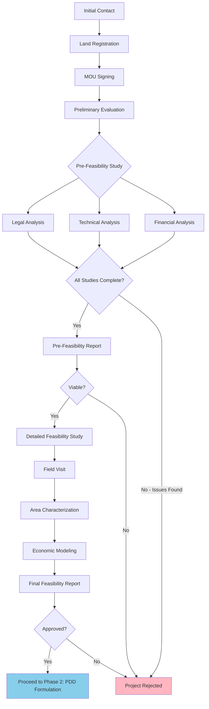

# Phase 1: Pre-Blockchain (Registry & Studies)

## Overview

Phase 1 represents all activities that occur **before blockchain technology** is involved. This extensive due diligence phase ensures that only viable, legally compliant, and financially sound carbon credit projects proceed to tokenization.

During this phase, the platform coordinates legal, technical, financial, and social teams to thoroughly evaluate potential carbon credit projects. This work establishes the foundation for accurate carbon credit estimation and risk assessment.

**Duration:** 6-18 months
**Blockchain Involvement:** None (traditional processes)
**Outcome:** Approved feasibility report determining project viability

---

## Visual Workflow

<figure markdown>
  
  <figcaption>Complete registration and pre-feasibility study workflow</figcaption>
</figure>

---

## Process Flow

---

## Key Stages

### Stage 1: Initial Contact & Registration

**Actors:** Administrator, Property Owner

**Activities:**

1. **Initial Meeting**
   - First contact between platform and potential project owner
   - Overview of carbon credit project opportunities
   - Preliminary project viability discussion
   - Introduction to the tokenization model

2. **Land Registry Submission**
   - Property owner submits property information
   - Basic documentation collection:
     - Property identification documents
     - Certificate of tradition and freedom (title deed)
     - Property maps and boundary plats
     - Data handling consent

3. **MOU Signing**
   - Memorandum of Understanding between parties
   - Establishes terms for feasibility study
   - Defines confidentiality and data use
   - Outlines next steps and timeline

**Duration:** 2-4 weeks
**Deliverable:** Signed MOU, initial property documentation

---

### Stage 2: Preliminary Technical Evaluation

**Actors:** Technical Agent, Legal Team

**Purpose:** Quick assessment to determine if detailed feasibility study is warranted

**Key Checks:**

- **Basic Land Eligibility:**
  - Property size meets minimum requirements
  - Location suitable for forestry/conservation projects
  - No obvious legal restrictions
  - Access to property is feasible

- **Preliminary Document Review:**
  - Title deed authenticity
  - No major encumbrances or liens
  - Basic compliance with land use regulations

- **Initial Technical Screening:**
  - Suitable climate and geography
  - Preliminary soil type assessment
  - General forest potential evaluation

**Outcome:** Go/No-Go decision for full pre-feasibility study
**Duration:** 1-2 weeks

---

### Stage 3: Pre-Feasibility Study

This comprehensive study involves three parallel work streams: Legal, Technical, and Financial analysis.

#### 3A. Legal Analysis

**Actors:** Legal Team

**Objectives:**
- Verify property ownership and legal status
- Identify legal restrictions or encumbrances
- Ensure regulatory compliance

**Key Activities:**

1. **Title Verification**
   - Certificate of tradition and liberty study
   - Ownership chain analysis
   - Verification of property boundaries

2. **Land Use Certificates**
   - Municipal territorial planning compliance
   - Allowed land uses for the property
   - Zoning restrictions

3. **Legal Restrictions Assessment**
   - Environmental authority restrictions
   - Protected area proximity
   - Indigenous territory verification
   - Land restitution database checks
   - Mining concessions review
   - Military or critical infrastructure restrictions

4. **Regulatory Compliance**
   - Colombian environmental law compliance
   - Forestry regulation requirements
   - Carbon market regulatory framework

**Deliverables:**
- Legal status report
- Risk assessment for legal issues
- Recommendations for legal compliance

---

#### 3B. Technical Analysis

**Actors:** Technical Team (Foresters, GIS Specialists, Environmental Engineers)

**Objectives:**
- Assess physical suitability for carbon projects
- Estimate carbon capture/reduction potential
- Identify technical constraints and opportunities

**Key Activities:**

1. **GIS (Geographic Information Systems) Analysis**

   Multi-layer spatial analysis to identify restrictions and opportunities:

   - **Municipal Territorial Planning (POT):**
     - Land use classifications
     - Development restrictions
     - Conservation zones

   - **Environmental Authority Restrictions:**
     - Regional environmental corporation (CAR) regulations
     - Buffer zones around water bodies (30m minimum)
     - Wetland protections
     - Biodiversity conservation areas

   - **Protected Areas:**
     - National parks proximity
     - Natural reserves
     - RUNAP registry verification

   - **Indigenous Reservations:**
     - Ministry of Interior consultation
     - Ethnic community presence verification
     - Prior consultation requirements if applicable

   - **Mining Concessions:**
     - ANNA MINERÍA database review
     - Active and projected mining areas
     - Potential conflicts

   - **Infrastructure Projections:**
     - Road development plans
     - Hydroelectric projects
     - Urban expansion areas

   - **Technology Restrictions:**
     - Military base proximity (drone limitations)
     - Airport zones (aeronautical regulations)
     - Oil infrastructure areas

2. **Soil Aptitude Verification**
   - SIPRA system analysis (Colombian soil database)
   - Soil classification for forestry potential
   - Drainage and erosion assessment
   - Preliminary species suitability

3. **Forest Potential Assessment**
   - Current forest cover evaluation
   - Native forest conservation areas
   - Suitable areas for new plantations
   - Existing plantation registration (ICA)

4. **Climate and Environmental Factors**
   - Rainfall patterns
   - Temperature ranges
   - Altitude considerations
   - Biodiversity considerations

**Deliverables:**
- GIS analysis report with restriction maps
- Soil suitability assessment
- Preliminary carbon potential estimate
- Technical feasibility assessment

---

#### 3C. Financial Analysis

**Actors:** Financial Team

**Objectives:**
- Assess economic viability
- Estimate project costs and revenues
- Determine investment requirements and returns

**Key Activities:**

1. **Asset Valuation**
   - Land market value assessment
   - Existing infrastructure valuation
   - Timber and forest product potential

2. **Revenue Model Projection**
   - Carbon credit revenue estimates
   - Timber sales projections (if applicable)
   - Other forest product revenues
   - Forestry incentives (CIF in Colombia)

3. **Cost Estimation**
   - Land preparation costs
   - Planting/restoration costs
   - Maintenance and monitoring
   - Certification and validation fees
   - Administrative costs

4. **Liquidity Analysis**
   - Cash flow timeline
   - Financing needs and timing
   - Revenue recognition periods

5. **Market Demand Assessment**
   - Current carbon credit prices
   - Market trends and projections
   - Buyer demand analysis

6. **Return on Investment**
   - Preliminary IRR calculation
   - NPV estimation
   - Payback period analysis
   - Risk-adjusted returns

**Deliverables:**
- Financial feasibility report
- Preliminary revenue projections
- Investment requirements estimate
- Risk assessment

---

### Stage 4: Pre-Feasibility Report & Decision

**Integration of All Analyses**

The legal, technical, and financial analyses are integrated into a comprehensive pre-feasibility report.

**Report Contents:**
- Executive summary
- Legal status and compliance assessment
- Technical suitability and carbon potential
- Financial viability and investment requirements
- Risk analysis (legal, technical, financial, social)
- Recommendation: Proceed or Reject

**Decision Gate:**
- ✅ **Proceed to Detailed Feasibility** - If all analyses show viability
- ❌ **Project Rejected** - If critical issues identified
- ⚠️ **Conditional Proceed** - If minor issues can be resolved

**Duration:** 2-4 months for complete pre-feasibility study

---

### Stage 5: Detailed Feasibility Study

If the pre-feasibility study is positive, a more detailed analysis is conducted.

#### 5A. Field Visit

**Purpose:** Physical verification and detailed site assessment

**Activities:**

1. **Site Inspection**
   - Property boundary verification
   - Current land use observation
   - Access routes and logistics assessment
   - Infrastructure evaluation

2. **Biophysical Data Collection**
   - Soil sampling at multiple points
   - Forest plot measurements
   - Tree species identification
   - Georeferencing of key areas

3. **Social Assessment**
   - Community interaction
   - Local stakeholder identification
   - Social impact preliminary assessment
   - Labor availability

4. **Logistics Planning**
   - Equipment access feasibility
   - Transportation routes
   - Material supply chains
   - Communication infrastructure

**Timing:** Preferably during rainy season for better assessment
**Duration:** 1-2 weeks on-site

---

#### 5B. Detailed Area Characterization

**Forest Inventory:**
- Existing forest plantations (species, age, density)
- Native forest areas for conservation
- Degraded areas suitable for restoration
- Available areas for new plantations

**Land Use Classification:**
- Productive forestry areas
- Conservation zones
- Buffer zones
- Infrastructure areas

**DOFA Analysis** (Weaknesses, Strengths, Opportunities, Threats):
- Internal strengths and weaknesses
- External opportunities and threats
- Risk mitigation strategies

---

#### 5C. Detailed Economic Feasibility

**Comprehensive Financial Modeling:**

1. **Itemized Project Costs**
   - Land preparation (per hectare)
   - Seedling/nursery costs
   - Planting labor
   - Maintenance (years 1-5, 6-10, etc.)
   - Monitoring equipment (IoT devices, drones)
   - Certification fees
   - Administrative overhead

2. **Revenue Projections**
   - Carbon credits by verification period (5-year intervals)
   - Timber revenue (if applicable)
   - Non-timber forest products
   - Ecosystem services payments
   - Colombian forestry incentives (CIF)

3. **Cash Flow Analysis**
   - Annual cash flows for 20-30 year project life
   - Monthly cash needs during establishment
   - Revenue timing and recognition
   - Working capital requirements

4. **Financial Metrics**
   - Internal Rate of Return (IRR)
   - Net Present Value (NPV)
   - Cost-Benefit ratio
   - Payback period
   - Sensitivity analysis

5. **Capital Structure**
   - Equity requirements
   - Debt capacity
   - Token financing proportion
   - Capital cost (WACC)

**Duration:** 1-2 months

---

### Stage 6: Forestry Management Plan (PEMF)

**For Colombian Projects:**

Development of the Plan de Establecimiento y Manejo Forestal (PEMF) as required by Colombian regulations.

**PEMF Contents:**
- Property description and legal status
- Biophysical characterization
- Forest management objectives
- Species selection and silvicultural plan
- Planting and maintenance schedules
- Protection and conservation measures
- Monitoring and evaluation plan

**Submission:** To regional environmental authority for approval

**Duration:** 1-2 months (if required)

---

### Stage 7: Final Feasibility Report

**Comprehensive Document Including:**

1. **Executive Summary**
   - Project overview
   - Key findings
   - Viability recommendation

2. **Legal Status Report**
   - Updated title verification
   - All regulatory approvals status
   - Legal risk assessment

3. **Technical Design**
   - Final area delineation
   - Species selection rationale
   - Silvicultural approach
   - Carbon estimation methodology
   - Monitoring plan overview

4. **Financial Model**
   - Complete cash flow projections
   - Sensitivity scenarios
   - Financing strategy
   - Risk mitigation measures

5. **Social and Environmental Impact**
   - Community benefits
   - Employment creation
   - Biodiversity impact
   - Water and soil conservation benefits

6. **Risk Assessment Matrix**
   - Legal risks and mitigation
   - Technical risks (climate, pests, etc.)
   - Financial risks (market, cost overruns)
   - Social risks (community relations)

7. **Recommendation**
   - **Approved:** Ready to proceed to PDD formulation (Phase 2)
   - **Conditional:** Specific items to resolve before proceeding
   - **Rejected:** Fundamental issues prevent viability

---

## Key Actors and Responsibilities

| Actor | Role | Key Responsibilities |
|-------|------|---------------------|
| **Property Owner** | Land provider | Provide documentation, site access, local knowledge |
| **Administrator (SUAN)** | Process coordinator | Manage all work streams, decision making, stakeholder communication |
| **Legal Team** | Legal compliance | Title verification, regulatory compliance, risk assessment |
| **GIS Specialists** | Spatial analysis | Multi-layer restriction mapping, area calculations |
| **Foresters** | Technical assessment | Species selection, forest management, carbon estimation |
| **Environmental Engineers** | Environmental compliance | Impact assessment, conservation planning |
| **Financial Analysts** | Economic viability | Cost estimation, revenue modeling, financial metrics |
| **Social Team** | Community relations | Stakeholder mapping, social impact, community engagement |

---

## Critical Success Factors

### Legal
- ✅ Clear property title without major encumbrances
- ✅ Compliance with all land use regulations
- ✅ No conflicts with protected areas or indigenous territories
- ✅ All necessary permits obtainable

### Technical
- ✅ Suitable climate, soil, and topography for target species
- ✅ Adequate area for economically viable carbon project
- ✅ Realistic carbon capture/reduction potential
- ✅ No major technical restrictions (mining, infrastructure, etc.)
- ✅ Access for implementation and monitoring

### Financial
- ✅ Positive NPV and acceptable IRR
- ✅ Manageable cash flow requirements
- ✅ Reasonable payback period
- ✅ Adequate market demand for carbon credits
- ✅ Acceptable risk profile

### Social
- ✅ Community support or neutrality
- ✅ No major social conflicts
- ✅ Local labor availability
- ✅ Positive social impact potential

---

## Common Rejection Reasons

Projects may be rejected during Phase 1 for:

- **Legal Issues:**
  - Unclear or disputed property titles
  - Location in protected areas or restricted zones
  - Conflicts with indigenous territories requiring complex prior consultation
  - Insurmountable regulatory barriers

- **Technical Issues:**
  - Unsuitable soil or climate conditions
  - Insufficient area for viable project
  - Major mining concessions or infrastructure conflicts
  - Excessive technology restrictions (drone limitations)

- **Financial Issues:**
  - Negative NPV or unacceptably low IRR
  - Excessive capital requirements
  - Unfavorable carbon credit market conditions
  - High-risk profile without mitigation options

- **Social Issues:**
  - Strong community opposition
  - Major social conflicts in the area
  - Land restitution claims in process

---

## Typical Timeline

| Activity | Duration | Cumulative Time |
|----------|----------|----------------|
| Initial Contact & MOU | 2-4 weeks | 1 month |
| Preliminary Evaluation | 1-2 weeks | 1.5 months |
| Pre-Feasibility Study | 2-4 months | 5.5 months |
| Decision Gate | 2 weeks | 6 months |
| Detailed Feasibility Study | 3-6 months | 12 months |
| PEMF Development (if needed) | 1-2 months | 14 months |
| Final Approval | 2-4 weeks | 15 months |

**Total Phase 1 Duration: 6-18 months** (depending on project complexity and issues encountered)

---

## Deliverables

By the end of Phase 1, the following documents should exist:

- [ ] Signed Memorandum of Understanding
- [ ] Property title documentation
- [ ] Legal status and compliance report
- [ ] GIS analysis with restriction maps
- [ ] Soil suitability assessment
- [ ] Forest potential evaluation
- [ ] Financial feasibility model
- [ ] Social impact preliminary assessment
- [ ] Final Feasibility Report with viability recommendation
- [ ] PEMF (if applicable for Colombian projects)

---

## Transition to Phase 2

If Phase 1 concludes with an **approved feasibility report**, the project transitions to Phase 2: Certification.

**What Happens Next:**
- Carbon standard selection
- PDD (Project Design Document) formulation
- External validation process
- Standard registration

The feasibility report becomes the foundation for the PDD, providing:
- Detailed project description
- Carbon estimation methodology
- Baseline scenario definition
- Monitoring plan framework
- Financial and implementation timeline

[Continue to Phase 2: Certification →](phase2-certification.md)

---

## Additional Resources

- [View Stakeholder Matrix →](../../reference/stakeholders.md)
- [View Project Timeline →](../../reference/timeline.md)
- [View Glossary →](../../reference/glossary.md)
- [Back to Overview →](index.md)
