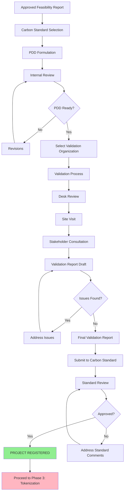

# Phase 2: Certification (PDD & Validation)

## Overview

Phase 2 transforms the approved feasibility study into a formally registered carbon credit project. This phase involves creating a Project Design Document (PDD) according to carbon standard requirements, undergoing independent validation, and achieving official registration with a carbon standard body.

This remains a **pre-blockchain** phase—no tokens exist yet. The goal is to establish a certified baseline and projected carbon credit estimates that will later be tokenized in Phase 3.

**Duration:** 3-6 months
**Blockchain Involvement:** None (traditional carbon market processes)
**Outcome:** Registered carbon credit project with validated carbon estimates

---

## Visual Workflow

<figure markdown>
  
  <figcaption>PDD formulation, validation, and standard registration process</figcaption>
</figure>

---

## Process Flow

---

## Key Stages

### Stage 1: Carbon Standard Selection

**Actors:** Administrator, Technical Team, Financial Team

**Purpose:** Choose the most appropriate carbon standard for the project

**Major Carbon Standards:**

#### 1. VCS (Verified Carbon Standard)
- **Operator:** Verra
- **Market:** Global voluntary market
- **Recognition:** Most widely recognized voluntary standard
- **Characteristics:**
  - Rigorous methodologies
  - Large project portfolio
  - High market liquidity
  - Strong brand recognition
- **Best For:** Projects targeting international voluntary markets

#### 2. CERCARBONO
- **Operator:** CERCARBONO (Colombian organization)
- **Market:** Latin America focus, global acceptance
- **Recognition:** Growing reputation, cost-effective
- **Characteristics:**
  - Colombian expertise
  - Spanish and English documentation
  - Competitive validation costs
  - Regional market knowledge
- **Best For:** Latin American projects, cost-sensitive projects

#### 3. BioCarbon Registry (BCR)
- **Operator:** BioCarbon Registry
- **Market:** Global voluntary market
- **Recognition:** Established standard
- **Characteristics:**
  - Transparent registry system
  - Independent third-party validation
  - Nature-based solutions focus
- **Best For:** Forestry and conservation projects

#### 4. Gold Standard
- **Operator:** Gold Standard Foundation
- **Market:** Premium voluntary market
- **Recognition:** High sustainability standards
- **Characteristics:**
  - Strict social and environmental criteria
  - Premium carbon credit pricing
  - Strong sustainability co-benefits
  - More complex requirements
- **Best For:** Projects with strong community benefits

#### 5. ColCx (Colombia Carbon Exchange)
- **Operator:** Colombian exchange
- **Market:** Colombian compliance and voluntary
- **Recognition:** National standard for Colombian carbon tax
- **Characteristics:**
  - Colombian carbon tax compliance
  - Local market focus
  - Government recognition
- **Best For:** Projects targeting Colombian carbon tax market

**Selection Criteria:**

- **Target Market:**
  - International vs. local buyers
  - Voluntary vs. compliance market
  - Carbon tax offset (Colombia)

- **Financial Considerations:**
  - Registration fees
  - Validation/verification costs
  - Ongoing annual fees
  - Potential credit pricing

- **Project Type Match:**
  - Forestry methodologies available
  - AFOLU (Agriculture, Forestry, Other Land Use) specialization
  - Appropriate baseline methodologies

- **Timeline:**
  - Registration processing time
  - Methodology approval timeframes
  - Verification period flexibility

- **Market Demand:**
  - Buyer preferences for specific standards
  - Market liquidity by standard
  - Price premiums for certain standards

**Duration:** 2-4 weeks
**Deliverable:** Selected carbon standard with rationale

---

### Stage 2: PDD (Project Design Document) Formulation

**Actors:** Technical Team, Administrator, External Consultants

**Purpose:** Create comprehensive project documentation meeting standard requirements

#### PDD Structure

Every carbon standard requires a detailed PDD, though formats vary. Common sections include:

#### 2A. General Project Information

- **Project Title and ID**
- **Project Location:**
  - Geographic coordinates
  - Political boundaries (country, department, municipality)
  - Maps and spatial data

- **Project Proponents:**
  - Legal entity information
  - Contact details
  - Organizational structure

- **Project Type:**
  - Afforestation/Reforestation (A/R)
  - Improved Forest Management (IFM)
  - REDD+ (Reducing Emissions from Deforestation and Degradation)
  - Other AFOLU activities

- **Project Duration:**
  - Start date
  - Crediting period (typically 20-30 years)
  - Verification period schedule (usually 5-year intervals)

---

#### 2B. Methodology and Baseline

- **Applicable Methodology:**
  - Selected standard methodology (e.g., VM0015 for VCS)
  - Methodology version
  - Justification for selection

- **Baseline Scenario:**
  - Description of what would happen without the project
  - Most likely land use without intervention
  - Baseline carbon stock estimation
  - Baseline emissions projection

- **Additionality Demonstration:**
  - Proof that project wouldn't happen without carbon finance
  - Regulatory surplus (beyond legal requirements)
  - Financial additionality analysis
  - Barrier analysis (technological, institutional, financial)

- **Project Scenario:**
  - Description of project activities
  - Expected land use changes
  - Management practices
  - Project carbon stock projections

---

#### 2C. Carbon Accounting

- **Carbon Pools Included:**
  - Above-ground biomass
  - Below-ground biomass
  - Dead wood
  - Litter
  - Soil organic carbon

- **GHG Sources and Sinks:**
  - CO₂ removals from atmosphere
  - CO₂ emissions from project activities
  - N₂O emissions (if applicable)
  - CH₄ emissions (if applicable)

- **Estimation Methodology:**
  - Biomass equations (allometric models)
  - IPCC default values or country-specific data
  - Sampling approach
  - Measurement frequency

- **Projected Carbon Credits:**
  - Total project emissions reductions/removals
  - Credits by verification period (e.g., 5-year intervals)
  - Conservative estimates with uncertainty deductions

**Example Projection:**
- Period 1 (Years 1-5): 50,000 tons CO₂eq
- Period 2 (Years 6-10): 120,000 tons CO₂eq
- Period 3 (Years 11-15): 180,000 tons CO₂eq
- Period 4 (Years 16-20): 200,000 tons CO₂eq
- **Total 20-year projection: 550,000 tons CO₂eq**

---

#### 2D. Monitoring Plan

- **Monitoring Parameters:**
  - Tree growth measurements (diameter, height)
  - Survival rates
  - Forest cover changes
  - Soil carbon (if included)

- **Monitoring Methods:**
  - Field sampling protocols
  - Permanent plot establishment
  - Remote sensing integration
  - IoT device deployment

- **Monitoring Frequency:**
  - Annual measurements
  - 5-year verification events
  - Continuous remote monitoring

- **Quality Assurance/Quality Control:**
  - Data collection procedures
  - Equipment calibration
  - Data validation protocols
  - Record keeping systems

---

#### 2E. Leakage Assessment

- **Leakage Definition:** Increased emissions outside project boundaries due to project activities

- **Potential Leakage Sources:**
  - Displacement of agricultural activities
  - Increased harvesting elsewhere
  - Market effects

- **Leakage Mitigation:**
  - Leakage monitoring plan
  - Leakage belt establishment
  - Leakage deduction calculations (typically 10-20%)

---

#### 2F. Permanence and Risk Management

- **Non-Permanence Risk:**
  - Risk of carbon loss due to fire, pests, disease, illegal logging
  - Risk mitigation measures
  - Insurance or buffer pool contribution

- **Buffer Pool Contribution:**
  - Percentage of credits withheld (typically 20-30%)
  - Risk assessment using standard tools
  - Buffer pool release conditions

---

#### 2G. Social and Environmental Safeguards

- **Stakeholder Consultation:**
  - Consultation process description
  - Stakeholder identification
  - Feedback received and addressed
  - Ongoing engagement plan

- **Community Benefits:**
  - Employment creation
  - Income generation
  - Infrastructure improvements
  - Capacity building

- **Biodiversity Impact:**
  - Positive biodiversity effects
  - Native species use
  - Habitat restoration
  - Conservation co-benefits

- **Do No Harm Principles:**
  - Environmental impact assessment
  - No negative social impacts
  - Free, Prior, and Informed Consent (FPIC) if applicable
  - Grievance mechanism

---

#### 2H. Financial Viability

- **Project Financing:**
  - Capital sources
  - Token-based financing structure
  - Traditional financing components
  - Budget breakdown

- **Revenue Model:**
  - Carbon credit sales projections
  - Timber or other product revenues
  - Token distribution model

- **Financial Sustainability:**
  - Long-term financial plan
  - Cost recovery mechanisms
  - Reinvestment strategy

---

**PDD Development Process:**

1. **Data Compilation:**
   - Gather all data from Phase 1 feasibility studies
   - Conduct additional field measurements if needed
   - Compile GIS data and maps

2. **Methodology Application:**
   - Apply selected carbon standard methodology
   - Follow prescribed equations and procedures
   - Calculate carbon estimates

3. **Document Drafting:**
   - Write comprehensive PDD following standard template
   - Include all supporting documentation
   - Prepare annexes (maps, data tables, calculations)

4. **Internal Review:**
   - Technical review by experts
   - Quality assurance checks
   - Stakeholder review

5. **Revisions:**
   - Address internal review comments
   - Update calculations as needed
   - Finalize document

**Duration:** 2-3 months
**Deliverable:** Complete PDD ready for validation

---

### Stage 3: Validation Organization Selection

**Actors:** Administrator

**Purpose:** Engage accredited third-party organization to validate PDD

**Requirements for Validation Organizations:**

- **Accreditation:** ISO/IEC 17029:2019 or equivalent
- **Standard Recognition:** Approved by the chosen carbon standard
- **Sectoral Expertise:** Experience with AFOLU projects
- **Geographic Coverage:** Ability to conduct site visits

**Colombian Accredited Organizations (Example):**

1. **AENOR INTERNACIONAL**
   - International presence
   - Multiple standard accreditations
   - Strong technical team

2. **ICONTEC**
   - Colombian organization
   - Local market knowledge
   - Cost-effective services

3. **VERSA EXPERTOS EN CERTIFICACIÓN**
   - Specialized in carbon projects
   - Latin American focus

4. **VERIFIT COLOMBIA**
   - Local expertise
   - Multiple standard capabilities

**Selection Criteria:**

- Technical competence
- Cost and fee structure
- Timeline and availability
- Track record with similar projects
- Standard-specific experience

**Contracting:**
- Engagement agreement
- Scope of work definition
- Timeline and milestones
- Fee structure

**Duration:** 2-4 weeks
**Deliverable:** Signed validation contract

---

### Stage 4: Validation Process

**Actors:** Validation Organization, Technical Team, Stakeholders

**Purpose:** Independent third-party verification that PDD meets standard requirements

#### 4A. Desk Review

**Activities:**

- **Document Review:**
  - Complete PDD analysis
  - Methodology application verification
  - Carbon calculation checks
  - Supporting document review

- **Completeness Check:**
  - All required sections present
  - Data adequacy assessment
  - Methodology compliance verification

- **Preliminary Findings:**
  - Identification of gaps or issues
  - Clarification requests (CRs)
  - Corrective action requests (CARs)

**Duration:** 2-4 weeks

---

#### 4B. Site Visit

**Purpose:** Physical verification of project area and claims

**Activities:**

1. **Opening Meeting:**
   - Validation team introduction
   - Validation scope and schedule review
   - Document requests

2. **Field Inspection:**
   - Project boundary verification
   - Land use confirmation
   - Baseline scenario verification
   - Management practices inspection

3. **Measurements:**
   - Sample plot measurements
   - GPS verification of coordinates
   - Infrastructure inspection

4. **Interviews:**
   - Project proponent interviews
   - Technical team discussions
   - Stakeholder consultations

5. **Closing Meeting:**
   - Preliminary findings presentation
   - Discussion of issues
   - Next steps clarification

**Duration:** 3-5 days on-site

---

#### 4C. Stakeholder Consultation

**Purpose:** Verify stakeholder engagement and gather feedback

**Methods:**
- Public comment period (typically 30 days)
- Direct stakeholder interviews
- Community meetings
- Written surveys

**Topics:**
- Project awareness and understanding
- Benefit sharing arrangements
- Potential negative impacts
- Grievances or concerns

---

#### 4D. Validation Report Development

**Report Sections:**

1. **Executive Summary**
2. **Validation Scope and Objectives**
3. **Methodology Used for Validation**
4. **Document Review Findings**
5. **Site Visit Findings**
6. **Stakeholder Consultation Results**
7. **GHG Calculation Verification**
8. **Compliance Assessment**
9. **Corrective Actions and Responses**
10. **Validation Conclusion**

**Validation Findings Categories:**

- **CAR (Corrective Action Request):**
  - Non-compliance with standard requirements
  - Must be resolved before validation approval

- **CR (Clarification Request):**
  - Need for additional information
  - Unclear documentation

- **FAR (Forward Action Request):**
  - Issues to address before verification
  - Non-critical for validation approval

**Iterative Process:**
- Project proponent addresses CARs and CRs
- Validator reviews responses
- Additional rounds if needed until all resolved

**Duration:** 4-8 weeks (including response iterations)

---

#### 4E. Final Validation Report and Opinion

**Validation Opinion:**

✅ **Positive Validation:**
- "The project meets all requirements of [Standard]"
- "Carbon estimates are reasonable and conservative"
- "Project is additional and complies with safeguards"
- **Result:** Approved for registration

❌ **Negative Validation:**
- Fundamental issues cannot be resolved
- Project does not meet standard requirements
- **Result:** Project cannot proceed (rare)

**Report Submission:**
- Submitted to project proponent
- Submitted to carbon standard
- Public availability (per standard requirements)

**Duration:** 1-2 weeks for final report

---

### Stage 5: Standard Registration

**Actors:** Carbon Standard Organization, Administrator

**Purpose:** Official project registration and issuance of unique project ID

**Process:**

1. **Submission Package:**
   - Complete PDD
   - Final validation report
   - Supporting documentation
   - Registration fees payment

2. **Standard Review:**
   - Completeness check
   - Quality assurance review
   - Methodology compliance verification
   - Potential additional questions

3. **Public Comment Period:**
   - Some standards require additional public comment (e.g., 30 days for VCS)
   - Stakeholder feedback opportunity
   - Project proponent must respond to comments

4. **Registration Decision:**
   - Standard committee or automated review
   - Approval or request for additional information
   - Rare rejection at this stage

5. **Project Registration:**
   - Unique project ID assigned
   - Project listed in standard's public registry
   - Registration certificate issued
   - Crediting period start date confirmed

**Duration:** 4-8 weeks

**Deliverable:** **Registered carbon credit project with validated carbon estimates**

---

## Key Outputs from Phase 2

Upon successful completion of Phase 2, the project has:

- [ ] **Selected Carbon Standard** (e.g., VCS, CERCARBONO)
- [ ] **Complete and Approved PDD**
- [ ] **Positive Validation Report** from accredited third party
- [ ] **Registered Project ID** with carbon standard
- [ ] **Validated Carbon Credit Projections** (e.g., 550,000 tons CO₂eq over 20 years)
- [ ] **Defined Verification Schedule** (typically 5-year periods)
- [ ] **Monitoring Plan** approved and ready for implementation
- [ ] **Public Registry Entry** with project details

---

## Critical Success Factors

### Documentation Quality
- ✅ Complete and accurate data
- ✅ Clear methodology application
- ✅ Conservative carbon estimates
- ✅ Comprehensive monitoring plan

### Validator Relationship
- ✅ Responsive communication
- ✅ Timely addressing of CARs/CRs
- ✅ Transparency and cooperation
- ✅ Quality of supporting evidence

### Stakeholder Engagement
- ✅ Genuine community consultation
- ✅ Documented feedback and responses
- ✅ Benefit-sharing clarity
- ✅ Grievance mechanism in place

### Technical Rigor
- ✅ Robust additionality case
- ✅ Credible baseline scenario
- ✅ Appropriate methodology selection
- ✅ Conservative uncertainty deductions

---

## Common Challenges and Solutions

| Challenge | Solution |
|-----------|----------|
| **Insufficient baseline data** | Conduct additional field measurements, use conservative defaults |
| **Additionality questions** | Strengthen financial analysis, demonstrate barriers, provide comparable project examples |
| **Stakeholder concerns** | Enhanced consultation, benefit-sharing adjustments, grievance mechanism |
| **Carbon estimation uncertainties** | Apply larger uncertainty deductions, use IPCC default values, increase monitoring frequency |
| **Validator CARs** | Detailed responses with supporting evidence, methodology expert consultation |
| **Standard registration delays** | Complete submission packages, proactive communication, anticipated public comments |

---

## Costs in Phase 2

**Typical Cost Breakdown:**

| Item | Estimated Cost (USD) |
|------|---------------------|
| **PDD Formulation** | $15,000 - $30,000 |
| - Consultant fees | $10,000 - $20,000 |
| - Additional field data | $3,000 - $7,000 |
| - Carbon modeling software | $2,000 - $3,000 |
| **Validation** | $20,000 - $50,000 |
| - Validation organization fees | $15,000 - $40,000 |
| - Site visit logistics | $3,000 - $7,000 |
| - Stakeholder consultation | $2,000 - $3,000 |
| **Standard Registration** | $5,000 - $15,000 |
| - Registration fees | $3,000 - $10,000 |
| - Annual fees (first year) | $2,000 - $5,000 |
| **TOTAL PHASE 2** | **$40,000 - $95,000** |

*Costs vary by project size, standard selection, and geographic location*

---

## Typical Timeline

| Activity | Duration | Cumulative Time |
|----------|----------|----------------|
| Carbon Standard Selection | 2-4 weeks | 1 month |
| PDD Formulation | 2-3 months | 4 months |
| Validation Organization Selection | 2-4 weeks | 4.5 months |
| Desk Review | 2-4 weeks | 5.5 months |
| Site Visit | 1 week | 5.75 months |
| Stakeholder Consultation | 30 days | 6.75 months |
| Response to CARs/CRs | 2-4 weeks | 7.5 months |
| Final Validation Report | 1-2 weeks | 8 months |
| Standard Registration | 4-8 weeks | 10 months |

**Total Phase 2 Duration: 3-10 months** (6 months average)

**Cumulative Time (Phase 1 + Phase 2): 9-28 months** (typically 12-18 months)

---

## Transition to Phase 3: Tokenization

With a **registered carbon credit project**, the foundation is now set for blockchain integration.

**What Happens Next:**

The validated carbon credit projections from the PDD become the basis for grey token minting. For example:

- **PDD Projection:** 550,000 tons CO₂eq over 20 years
- **Grey Tokens to Mint:** 550,000 tokens (1 token = 1 estimated ton CO₂eq)

These tokens will be distributed among stakeholders and used for fundraising **before** any actual carbon credits are certified.

**Phase 3 Activities:**
- Administrator account and smart contract setup
- Grey token minting based on PDD projections
- Token distribution to stakeholders
- Marketplace launch and investor fundraising
- Fiduciary fund establishment

[Continue to Phase 3: Grey Tokens →](phase3-grey-tokens.md)

---

## Additional Resources

- [View Carbon Standards Comparison →](../../reference/glossary.md)
- [View Stakeholder Matrix →](../../reference/stakeholders.md)
- [View Project Timeline →](../../reference/timeline.md)
- [Back to Overview →](index.md)
- [Previous: Phase 1 →](phase1-pre-blockchain.md)
