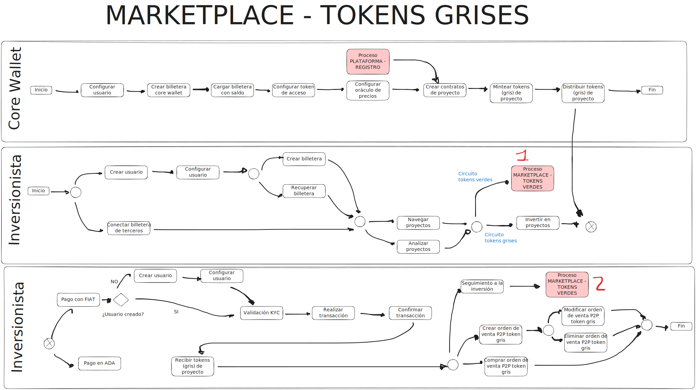
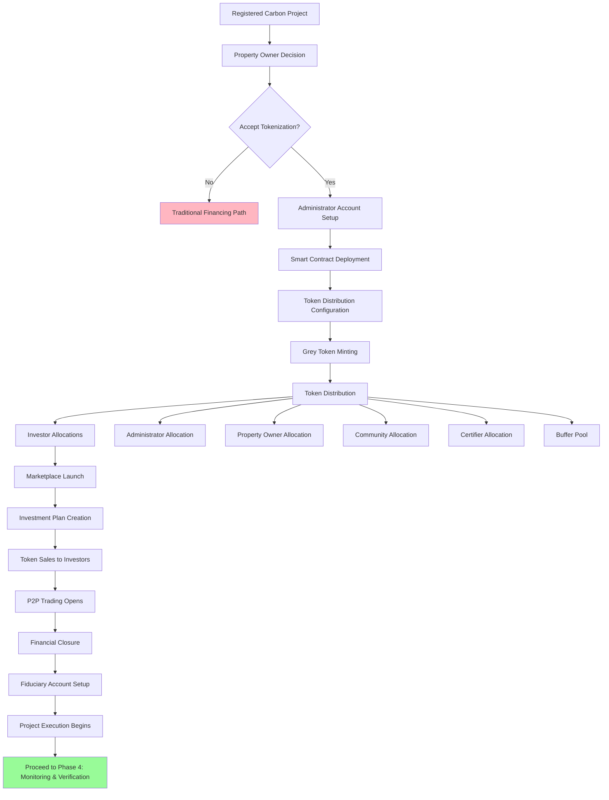

# Phase 3: Grey Tokens (Tokenization & Fundraising)

## Overview

Phase 3 marks the **transition to blockchain**. With a registered carbon credit project and validated carbon projections, the platform now deploys smart contracts and mints grey tokens representing estimated (not yet certified) carbon credits.

Grey tokens enable early-stage project funding by allowing investors to purchase tokens before actual carbon credits are certified. This innovative financing mechanism provides capital for project execution while distributing risk and rewards among multiple stakeholders.

**Duration:** 2-4 months for setup, ongoing for fundraising
**Blockchain:** Cardano
**Outcome:** Funded project ready for execution, grey tokens in circulation

---

## Visual Workflow

<figure markdown>
  
  <figcaption>Tokenization, smart contract deployment, and fundraising workflow</figcaption>
</figure>

---

## Process Flow



---

## What Are Grey Tokens?

### Definition

**Grey tokens** are blockchain-based digital assets representing **estimated** carbon credits that have not yet been verified or certified.

**Key Characteristics:**

- **Based on Projections:** Quantity determined by validated PDD estimates
- **Not Yet Certified:** Represent future carbon capture/reduction potential
- **Property/Investment Tokens:** Provide rights to future green tokens
- **Tradeable:** Can be bought and sold on the marketplace
- **Risk-Bearing:** Subject to verification outcomes (actual vs. estimated)

### Token Ratio

```
1 Grey Token = 1 Estimated Ton CO₂eq (from PDD)
```

**Example:**
- PDD projects 550,000 tons CO₂eq over 20 years
- 550,000 grey tokens are minted
- Each token represents 1 ton of estimated carbon credit

---

## Key Stages

### Stage 1: Tokenization Decision

**Actors:** Property Owner, Administrator

**Activities:**

1. **Review Tokenization Terms:**
   - Token distribution percentages
   - Property contribution structure
   - Compensation mechanisms
   - Long-term commitments

2. **Understand Token Model:**
   - Grey vs. green token distinction
   - Redemption schedule (by verification period)
   - Buffer pool concept
   - Risk and reward sharing

3. **Accept Commercialization Conditions:**
   - Formal agreement to tokenize project
   - Property owner consent
   - Legal documentation
   - Benefit-sharing confirmation

4. **Decision Point:**
   - ✅ **Accept:** Proceed with tokenization
   - ❌ **Decline:** Pursue traditional financing

**Duration:** 2-4 weeks
**Deliverable:** Signed tokenization agreement

---

### Stage 2: Administrator Account Creation

**Actors:** Administrator (SUAN Platform)

**Purpose:** Establish on-chain infrastructure for smart contract management

**Activities:**

1. **Main Administrator Wallet:**
   - Create Cardano wallet for platform operations
   - Secure key management implementation
   - Multi-signature configuration (if applicable)

2. **Project-Specific Accounts:**
   - Dedicated wallet for this specific project
   - Contract deployment address
   - Token minting authority setup

3. **Pricing Services Configuration:**
   - Oracle integration for ADA/USD pricing
   - Market data feeds
   - Price discovery mechanisms

4. **Security Measures:**
   - Hardware wallet integration
   - Access control policies
   - Backup and recovery procedures

**Duration:** 1-2 weeks
**Deliverable:** Configured administrator accounts and infrastructure

---

### Stage 3: Smart Contract Deployment

**Actors:** Administrator, Smart Contract Developers

**Purpose:** Deploy project-specific smart contracts to Cardano blockchain

#### Smart Contracts in Phase 3

##### 3A. Genesis Minting Contract

**Function:** Initial grey token creation

**Parameters:**
- Total token supply (from PDD projection)
- Token name and ticker symbol
- Metadata standards (CIP68 for NFT-style tokens)
- Distribution allocations

**Process:**
1. Contract compiled and tested
2. Deployed to Cardano mainnet
3. Minting transaction executed
4. Total token supply created in single event

---

##### 3B. Stakeholder Allocation Contracts

Individual smart contracts manage token allocations for each stakeholder group:

**1. Investor Contract**
- Manages tokens allocated for investor purchase
- Handles token sales and transfers
- Tracks investor holdings
- Enforces lock-up periods (if applicable)

**2. Administrator Contract**
- Platform operator's token allocation
- Compensation for services
- Incentive alignment mechanism

**3. Property Owner Contract**
- Landowner's token allocation
- Property contribution compensation
- Long-term participation reward

**4. Community Contract**
- Local stakeholder benefits
- Community development allocation
- Social impact token pool

**5. Certifier (BioC) Contract**
- Certification entity allocation
- Validator/verifier compensation
- Quality assurance incentives

**6. Buffer Contract**
- Risk management token pool
- Handles variance between estimated and actual credits
- Automated buffer release/burn logic

---

##### 3C. Marketplace Contracts

**Token Trading Contract:**
- Enables P2P grey token trading
- Facilitates secondary market
- Enforces trading rules and fees

**Pricing Contract:**
- Dynamic pricing mechanisms
- Order book management
- Price discovery algorithms

---

**Deployment Process:**

1. **Smart Contract Development:**
   - Written in OpShin (Plutus-equivalent for Python)
   - Comprehensive testing on testnet
   - Security audits

2. **Testnet Deployment:**
   - Deploy to Cardano Preview or Preprod testnet
   - Functional testing
   - Integration testing with frontend

3. **Audit and Review:**
   - External security audit (recommended)
   - Code review by independent developers
   - Vulnerability assessment

4. **Mainnet Deployment:**
   - Deploy contracts to Cardano mainnet
   - Verify contract addresses
   - Document all contract addresses and transaction IDs

**Duration:** 3-6 weeks (if contracts are already developed and audited)
**Deliverable:** Deployed and verified smart contracts on Cardano mainnet

[View contract architecture details →](../../contracts/protocol-validator.md)

---

### Stage 4: Token Distribution Configuration

**Actors:** Administrator, Property Owner, Community Representatives

**Purpose:** Determine how grey tokens will be allocated among stakeholders

#### Distribution Methodology

Distribution percentages are negotiated based on:
- Property contribution value
- Capital requirements
- Risk sharing philosophy
- Community benefit commitments
- Certifier compensation structure

**Example Distribution (from Lightpaper):**

| Stakeholder | Allocation | Tokens (550k total) | Rationale |
|-------------|-----------|---------------------|-----------|
| **Investors** | 33.60% | 184,800 | Provide project funding |
| **Buffer Pool** | 25.62% | 140,910 | Risk management for actual vs. estimated variance |
| **Certifier (BioC)** | 13.59% | 74,745 | Validation/verification services |
| **Property Owner** | 13.22% | 72,710 | Land contribution |
| **Administrator** | 12.35% | 67,925 | Platform operation, coordination |
| **Community** | 1.61% | 8,855 | Local stakeholder benefits |
| **TOTAL** | 100% | 550,000 | Complete token allocation |

#### Token Vesting and Lock-ups

Some allocations may have vesting schedules or lock-up periods:

- **Investors:** Immediate tradability (or tiered lock-ups by risk tier)
- **Administrator:** Partial vesting over project timeline
- **Property Owner:** Long-term lock-up to ensure commitment
- **Community:** Gradual release over verification periods
- **Certifier:** Released upon verification milestones
- **Buffer:** Locked until redemption events

**Configuration Steps:**

1. **Stakeholder Negotiation:**
   - Present distribution proposal
   - Negotiate percentages
   - Finalize allocation agreement

2. **Smart Contract Configuration:**
   - Set allocation percentages in contracts
   - Configure vesting schedules
   - Set lock-up periods and release triggers

3. **Legal Documentation:**
   - Token allocation agreements
   - Rights and obligations clarification
   - Governance structure (if applicable)

**Duration:** 2-4 weeks
**Deliverable:** Agreed token distribution with configured smart contracts

---

### Stage 5: Grey Token Minting

**Actors:** Administrator (executing smart contract)

**Purpose:** Create the total supply of grey tokens on Cardano blockchain

**Minting Event:**

1. **Pre-Minting Verification:**
   - Verify PDD carbon projection (550,000 tons CO₂eq)
   - Confirm smart contract deployment
   - Verify distribution configuration

2. **Minting Transaction:**
   - Execute Genesis Minting Contract
   - Create 550,000 grey tokens in single transaction
   - Tokens initially held in minting contract

3. **Metadata Assignment:**
   - CIP68 compliant metadata
   - Project information (name, ID, standard)
   - Carbon projection details
   - Distribution schedule

4. **Token Distribution Transaction:**
   - Transfer tokens to stakeholder contracts according to allocation:
     - 184,800 → Investor Contract
     - 140,910 → Buffer Contract
     - 74,745 → Certifier Contract
     - 72,710 → Property Owner Contract
     - 67,925 → Administrator Contract
     - 8,855 → Community Contract

5. **Blockchain Verification:**
   - Verify total supply on Cardano explorer
   - Confirm distribution to all contracts
   - Validate metadata

**Token Characteristics:**

- **Blockchain:** Cardano
- **Token Standard:** CIP68 (if NFT-style) or native fungible tokens
- **Divisibility:** Typically non-divisible (1 token = 1 ton, indivisible)
- **Total Supply:** Fixed at minting (550,000 in example)
- **Additional Minting:** None (one-time mint event)

**Duration:** 1-2 days
**Deliverable:** Minted grey tokens distributed to stakeholder contracts

---

### Stage 6: Marketplace Initialization

**Actors:** Administrator, Development Team

**Purpose:** Launch platform marketplace for grey token trading

**Components:**

1. **Investment Plan Configuration:**

   Create structured investment opportunities with different risk/reward profiles:

   **Example Investment Plans:**

   | Plan | Lock-up Period | Token Price | Projected ROI | Risk Level |
   |------|---------------|-------------|---------------|------------|
   | **Early Bird** | 2 years | $8/token | Higher | Higher (long commitment) |
   | **Standard** | 1 year | $10/token | Medium | Medium |
   | **Flexible** | None | $12/token | Lower | Lower (immediate liquidity) |

   **Period-Based Plans:**
   - Period 1 tokens (Years 1-5 redemption)
   - Period 2 tokens (Years 6-10 redemption)
   - Full project tokens (all periods)

2. **Primary Market Setup:**

   Direct sales from Investor Contract:
   - Set initial offering price
   - Define purchase limits (min/max per investor)
   - KYC/AML integration (if required)
   - Payment methods (ADA, fiat on-ramp)

3. **Secondary Market (P2P Trading):**

   Enable investor-to-investor trading:
   - Order book creation
   - Bid/ask spread management
   - Trading fee structure
   - Liquidity incentives

4. **Marketplace Features:**
   - Real-time token price display
   - Trading volume analytics
   - Project information dashboard
   - Carbon credit projection visualization
   - Verification timeline display

**Duration:** 2-4 weeks
**Deliverable:** Live marketplace with configured investment plans

---

### Stage 7: Fundraising (Grey Token Sales)

**Actors:** Investors, Administrator, Marketing Team

**Purpose:** Sell grey tokens to raise capital for project execution

#### Fundraising Strategies

##### 7A. Financing Sources Listing

**Target Investor Categories:**

1. **Impact Investors:**
   - Environmental, Social, Governance (ESG) focused
   - Carbon credit portfolio builders
   - Sustainable forestry investors

2. **Carbon Credit Buyers:**
   - Corporations seeking future offset commitments
   - Early purchase for price hedging
   - Carbon-neutral goal planning

3. **Blockchain Investors:**
   - Cardano ecosystem participants
   - DeFi yield seekers
   - Tokenized asset enthusiasts

4. **Local Investors:**
   - Colombian individuals and businesses
   - Regional impact investment funds
   - Community members

##### 7B. Marketing and Outreach

**Channels:**
- Carbon credit marketplaces
- Blockchain/crypto platforms
- ESG investment networks
- Direct corporate outreach
- Regional roadshows

**Messaging:**
- Environmental impact potential
- Carbon credit price trends
- Tokenization benefits (liquidity, fractional ownership)
- Project credibility (registered with standard)
- Transparent blockchain tracking

##### 7C. Sales Process

1. **Investor Onboarding:**
   - Account creation on platform
   - KYC/AML verification (if required)
   - Wallet connection (Cardano)

2. **Investment Selection:**
   - Choose investment plan
   - Select token quantity
   - Review terms and risks

3. **Purchase Transaction:**
   - Payment (ADA or fiat)
   - Smart contract executes transfer
   - Tokens transferred to investor wallet

4. **Post-Purchase:**
   - Receive digital receipt and token proof
   - Access to project monitoring dashboard
   - Notifications for project milestones

##### 7D. Investor Base Expansion

**Growth Tactics:**
- Referral programs
- Token holder rewards
- Community building
- Regular project updates
- Transparency reports

---

#### Fundraising Metrics

**Success Indicators:**

- **Token Sale Progress:**
  - Target: Sell 70-80% of investor allocation
  - Example: 129,360 of 184,800 investor tokens sold

- **Capital Raised:**
  - Target fundraising amount based on project budget
  - Example: $1.5M raised at $12/token average

- **Investor Diversity:**
  - Number of unique investors (prefer broad distribution)
  - Geographic diversity
  - Investor type mix

**Duration:** 3-12 months (ongoing until fundraising target met)
**Deliverable:** Sufficient capital raised to fund project execution

---

### Stage 8: Financial Closure

**Actors:** Administrator, Financial Team, Fiduciary Entity

**Purpose:** Formalize financial structure and capital deployment plan

**Activities:**

1. **Capital Cost Formalization:**
   - Calculate Weighted Average Cost of Capital (WACC)
   - Determine discount rate (e.g., 13.27% from Lightpaper example)
   - Financial risk evaluation

2. **Funding Allocation:**
   - Budget alignment with raised capital
   - Timeline for capital deployment
   - Reserve funds for contingencies

3. **Prior Conditions Compliance:**
   - Legal requirements fulfilled
   - Regulatory compliance verified
   - Contractual obligations met

4. **Financial Document Signing:**
   - Funding agreements
   - Fiduciary contracts
   - Disbursement schedules

**Duration:** 2-4 weeks
**Deliverable:** Closed financial structure ready for execution

---

### Stage 9: Fiduciary Execution

**Actors:** Fiduciary Entity, Administrator

**Purpose:** Manage and disburse funds according to project plan

**Fiduciary Responsibilities:**

1. **Documentation Review and Validation:**
   - Verify all legal and financial documents
   - Compliance with fiduciary standards
   - Risk assessment

2. **Fiduciary Account Opening/Administration:**
   - Dedicated account for project funds
   - Segregated from other accounts
   - Multi-signature controls (if applicable)

3. **Investment Monitoring and Management:**
   - Track capital deployment against plan
   - Monitor project execution milestones
   - Verify expenditures

4. **Disbursement Execution:**
   - Release funds according to approved schedule
   - Milestone-based payments (e.g., planting completion)
   - Vendor payments for project activities

5. **Fiduciary Report Generation:**
   - Monthly financial statements
   - Quarterly progress reports
   - Annual audited reports
   - Transparent reporting to investors

**Duration:** Ongoing throughout project execution
**Deliverable:** Transparent fund management with regular reporting

---

## Grey Token Economics

### Token Value Proposition

**For Investors:**
- Early access to carbon credits at potentially lower prices
- Fractional ownership of large carbon projects
- Liquidity through secondary market trading
- Transparent blockchain tracking
- Future green token redemption rights

**For Property Owners:**
- Immediate token allocation (future value)
- No upfront capital requirement
- Continued land ownership
- Participation in carbon credit upside

**For Community:**
- Direct benefit sharing
- Transparent allocation
- Long-term community development funding

### Pricing Dynamics

**Initial Pricing Factors:**
- PDD carbon projection quantity
- Current carbon credit market prices
- Project execution costs
- Risk assessment (technical, market, regulatory)
- Discount for non-certified status

**Example Pricing Logic:**

```
Certified Carbon Credit Market Price (Today): $15/ton
Grey Token Discount: 40% (for non-certified, time value, risk)
Grey Token Initial Price: $9/ton (token)

Investor buys at $9, expects future value:
- Conservative: $12 (20% discount to market at redemption)
- Base case: $15 (market rate at redemption)
- Optimistic: $18+ (if carbon prices increase)
```

**Secondary Market Pricing:**
- Supply/demand dynamics
- Carbon credit market trends
- Project execution progress
- Verification timeline proximity
- Buffer pool adequacy perception

---

## Risk Management: Buffer Pool

### Purpose

The buffer pool protects against **variance between estimated and actual carbon credits**.

**Scenarios:**

1. **Actual < Estimated (Shortfall):**
   - Example: PDD estimated 50,000 tons for Period 1, but actual verified only 40,000 tons
   - Buffer pool covers the 10,000 ton gap
   - Investors still receive their proportional green tokens

2. **Actual = Estimated (On Target):**
   - Buffer tokens released to stakeholders proportionally
   - Bonus distribution

3. **Actual > Estimated (Excess):**
   - Premium redemption rate
   - Stakeholders receive more green tokens than grey tokens held
   - Upside sharing

### Buffer Pool Size

**Typical:** 20-30% of total tokens
**Example:** 140,910 buffer tokens (25.62%) from 550,000 total

**Rationale:**
- Historical variance in carbon projects
- Technical risks (pests, fire, disease)
- Climate variability
- Methodology conservativeness

---

## Governance and Transparency

### Investor Rights

- Access to project monitoring data
- Regular progress updates
- Financial reports
- Voting rights (if governance token features enabled)
- Grievance mechanism

### Transparency Mechanisms

1. **Blockchain Transparency:**
   - All token transactions publicly verifiable
   - Smart contract code open source
   - Token distribution visible on-chain

2. **Project Transparency:**
   - Monthly progress reports
   - Monitoring data dashboard (IoT, satellite imagery)
   - Financial expenditure reporting
   - Milestone achievement tracking

3. **Third-Party Verification:**
   - Annual third-party audits (financial)
   - Independent monitoring verification
   - Validator/verifier reports (Phase 4)

---

## Legal and Regulatory Considerations

### Securities Compliance

Depending on jurisdiction, grey tokens may be classified as securities.

**Compliance Measures:**
- Legal opinion on token classification
- KYC/AML procedures for investors
- Accredited investor restrictions (if applicable)
- Regulatory filings (if required)
- Terms of service and disclaimers

### Carbon Market Regulations

- Compliance with carbon standard rules
- Colombian carbon tax regulations (if applicable)
- International carbon market regulations
- Anti-money laundering for carbon credits

### Smart Contract Legal Status

- Legal enforceability of smart contract terms
- Dispute resolution mechanisms
- Jurisdiction and governing law
- Force majeure provisions

---

## Transition to Phase 4: Monitoring & Verification

With grey tokens distributed and the project funded, execution begins.

**What Happens Next:**

1. **Project Implementation:**
   - Land preparation
   - Planting/restoration activities
   - Infrastructure development
   - Community engagement

2. **Monitoring Initiation:**
   - IoT device deployment
   - Satellite imagery subscription
   - Permanent plot establishment
   - Baseline measurements

3. **Ongoing Monitoring:**
   - Continuous data collection
   - Annual measurements
   - Progress tracking
   - Adaptive management

4. **Verification Preparation:**
   - Data compilation for verification (every 5 years)
   - Verification organization engagement
   - Site visit coordination

5. **Certification:**
   - Verified carbon credits issued by standard
   - Green token minting preparation
   - Grey to green redemption events

[Continue to Phase 4: Green Tokens →](phase4-green-tokens.md)

---

## Key Takeaways

- Grey tokens represent **estimated, non-certified** carbon credits
- Enable **early-stage project financing** through tokenization
- Distributed among **multiple stakeholders** for risk and reward sharing
- Traded on **blockchain marketplace** for liquidity
- **Buffer pool** manages variance between estimated and actual credits
- Redeemable for **green tokens** (certified credits) after verification
- Provides **transparent, blockchain-tracked** project funding

---

## Additional Resources

- [Smart Contract Architecture →](../../contracts/protocol-validator.md)
- [Protocol NFTs →](../../contracts/protocol-nfts.md)
- [Token Types and Standards →](../../architecture/types.md)
- [View Stakeholder Matrix →](../../reference/stakeholders.md)
- [View Glossary →](../../reference/glossary.md)
- [Back to Overview →](index.md)
- [Previous: Phase 2 →](phase2-certification.md)
