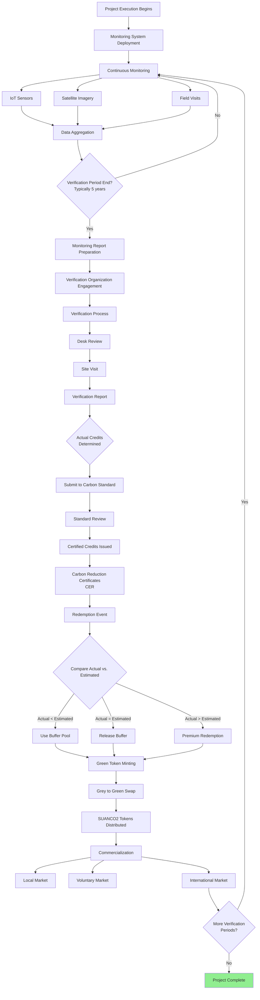

# Phase 4: Green Tokens (Verification & Trading)

## Overview

Phase 4 is the **ongoing operational phase** where the carbon credit project executes, captures/reduces carbon, and periodically converts grey tokens into green tokens representing certified carbon credits.

This phase involves continuous monitoring of project activities, periodic third-party verification (typically every 5 years), certification by the carbon standard, and redemption of grey tokens for green tokens (SUANCO2). Finally, certified green tokens can be traded in various carbon markets.

**Duration:** Ongoing for 20-30 years (entire project crediting period)
**Frequency:** Verification every 5 years (periods)
**Outcome:** Certified carbon credits as tradeable digital assets (green tokens)

---

## Visual Workflow

<figure markdown>
  
  <figcaption>Verification, certification, redemption, and commercialization workflow</figcaption>
</figure>

---

## Process Flow



---

## What Are Green Tokens?

### Definition

**Green tokens (SUANCO2)** are blockchain-based digital assets representing **certified** carbon credits that have been verified by third parties and issued by a carbon standard.

**Key Characteristics:**

- **Verified Credits:** Based on actual measured carbon capture/reduction
- **Standard-Certified:** Issued by carbon standard (VCS, CERCARBONO, etc.)
- **1:1 Backing:** Each token backed by unique carbon reduction certificate
- **Fully Tradeable:** Can be sold in carbon markets
- **Retirement Capable:** Can be retired to claim carbon offset

### Token Ratio

```
1 Green Token (SUANCO2) = 1 Certified Ton CO₂eq Reduction
```

**Example:**
- Period 1 verification: 45,000 tons CO₂eq certified (instead of 50,000 estimated)
- 45,000 green tokens minted
- Grey token holders redeem at adjusted ratio

---

## Key Stages

### Stage 1: Project Execution and Monitoring

**Actors:** Project Implementation Team, Monitoring Team, Technology Team

**Purpose:** Execute project activities and collect data for verification

#### 1A. Project Implementation

**Activities Depend on Project Type:**

**For Afforestation/Reforestation Projects:**
- Land preparation (clearing, soil preparation)
- Seedling production or procurement
- Planting activities (seasonal)
- Maintenance (weeding, fertilization, pest control)
- Fire prevention and protection
- Infrastructure development (roads, nurseries, storage)

**For Forest Conservation Projects (REDD+):**
- Protection activities (patrols, enforcement)
- Community alternative livelihoods
- Fire prevention systems
- Biodiversity monitoring
- Sustainable use programs

**For Improved Forest Management:**
- Reduced impact logging techniques
- Extended rotation periods
- Enhanced regeneration practices
- Carbon stock enhancement activities

---

#### 1B. Monitoring System Deployment

**Purpose:** Implement the monitoring plan approved in the PDD

**Components:**

##### 1. IoT Sensor Network

**Devices:**
- Soil moisture sensors
- Temperature and humidity sensors
- Growth sensors (dendrometers for tree diameter)
- Camera traps (wildlife, fire detection)
- Weather stations

**Benefits:**
- Real-time data collection
- Continuous monitoring
- Early warning for issues (fire, drought, pests)
- Reduced field visit frequency
- Data transparency for investors

**Deployment:**
- Strategic placement across project area
- Cellular or satellite connectivity
- Solar-powered for remote locations
- Data transmitted to cloud platform

##### 2. Satellite Imagery and Remote Sensing

**Sources:**
- Sentinel-2 (European Space Agency - free, 10m resolution)
- Landsat (NASA - free, 30m resolution)
- Planet Labs (commercial, daily imagery)
- Radar sensors (SAR) for cloud penetration

**Applications:**
- Forest cover change detection
- Biomass estimation (via vegetation indices)
- Deforestation monitoring
- Fire detection
- Illegal activity detection

**Frequency:**
- Monthly or quarterly imagery analysis
- Annual comprehensive analysis
- Real-time alerts for deforestation

##### 3. Field Measurements

**Permanent Sample Plots:**
- Stratified random sampling design
- GPS-georeferenced plots
- Periodic measurements (annual or biannual)

**Measurements:**
- **Dasometric data:**
  - Tree diameter at breast height (DBH)
  - Tree height
  - Species identification
  - Survival/mortality counts

- **Soil sampling:**
  - Soil organic carbon (if included in project)
  - Soil depth and composition

- **Biodiversity co-benefits:**
  - Species richness
  - Wildlife observations

**Frequency:**
- Annual measurements during crediting period
- Intensive measurements before verification events

---

#### 1C. Data Collection and Management

**Data Aggregation:**
1. **IoT Data:** Continuous collection, cloud storage
2. **Satellite Data:** Periodic downloads and analysis
3. **Field Data:** Manual data entry, quality control
4. **Integration:** Combined database with all monitoring sources

**Quality Assurance/Quality Control (QA/QC):**
- Equipment calibration procedures
- Double data entry for field measurements
- Statistical validation (outlier detection)
- Third-party data audits

**Data Transparency:**
- Investor dashboard with real-time monitoring data
- Public-facing project progress page
- Blockchain-timestamped data hashes (proof of monitoring)

**Duration:** Ongoing throughout entire crediting period (20-30 years)

---

### Stage 2: Monitoring Report Preparation

**Actors:** Technical Team, Monitoring Team

**Purpose:** Compile monitoring data into verification-ready report

**Timing:** Before each verification event (typically every 5 years)

**Report Contents:**

1. **Executive Summary:**
   - Project progress overview
   - Key achievements
   - Challenges encountered
   - Carbon stock changes

2. **Project Implementation Review:**
   - Activities completed
   - Timeline adherence
   - Budget vs. actual expenditures
   - Adaptive management decisions

3. **Monitoring Data Synthesis:**
   - Field measurement results
   - IoT sensor data trends
   - Remote sensing analysis
   - Data quality assessment

4. **Carbon Stock Calculations:**
   - Biomass estimation using allometric equations
   - Carbon stock changes from baseline
   - GHG emission sources and sinks
   - Net carbon benefit calculation

5. **Leakage Assessment:**
   - Leakage monitoring results
   - Leakage deductions applied

6. **Permanence and Risk:**
   - Risk events during period (fire, pests, illegal logging)
   - Mitigation measures implemented
   - Permanence assurance

7. **Co-Benefits:**
   - Biodiversity improvements
   - Community benefits delivered
   - Employment created
   - Other ecosystem services

8. **Supporting Documentation:**
   - Raw data tables
   - Field measurement sheets
   - Satellite imagery analysis
   - IoT data dashboards
   - Photographic evidence

**Carbon Credit Calculation Example (Period 1: Years 1-5):**

```
Baseline Carbon Stock (Year 0): 10,000 tons CO₂eq
Project Carbon Stock (Year 5): 60,000 tons CO₂eq
Net Change: +50,000 tons CO₂eq

Minus Leakage (15%): -7,500 tons
Minus Uncertainty Deduction (10%): -4,250 tons

Net Verified Credits (Period 1): 38,250 tons CO₂eq
```

Compare to PDD estimate for Period 1: 50,000 tons
**Variance:** -23.5% (actual lower than estimated)

**Duration:** 2-3 months to compile comprehensive report
**Deliverable:** Monitoring Report submitted to verification organization

---

### Stage 3: Verification Process

**Actors:** Accredited Verification Organization, Project Team

**Purpose:** Independent third-party validation of actual carbon credits

**Timing:** Every verification period (typically every 5 years)

#### 3A. Verification Organization Selection

**Process:** Similar to validation in Phase 2, but for **verification** of results

**Requirements:**
- ISO/IEC 17029:2019 accreditation
- Carbon standard approval for verification
- AFOLU sector expertise
- No conflict of interest (can be same as validator or different)

**Contracting:**
- Scope of work for verification
- Timeline and site visit schedule
- Fee structure (typically lower than validation)

---

#### 3B. Desk Review

**Verification Team Activities:**

1. **Monitoring Report Review:**
   - Completeness check
   - Methodology adherence verification
   - Data quality assessment
   - Calculation verification

2. **Data Validation:**
   - Recalculate carbon stock changes
   - Verify allometric equation application
   - Check sampling adequacy
   - Validate remote sensing analysis

3. **QA/QC Review:**
   - Data collection procedure compliance
   - Equipment calibration records
   - Statistical validity checks

4. **Preliminary Findings:**
   - Clarification Requests (CRs)
   - Corrective Action Requests (CARs)
   - Data gaps identification

**Duration:** 2-4 weeks

---

#### 3C. Site Visit

**Purpose:** Physical verification of project implementation and data

**Activities:**

1. **Field Verification:**
   - Visit sample plots (subset verification)
   - Independent measurements on sample plots
   - GPS verification of plot locations
   - Biomass measurement verification

2. **Implementation Verification:**
   - Confirm project activities occurred
   - Assess project boundary integrity
   - Verify management practices
   - Infrastructure inspection

3. **IoT and Monitoring System Inspection:**
   - Verify sensor functionality
   - Check data transmission integrity
   - Review calibration records

4. **Stakeholder Interviews:**
   - Project team interviews
   - Community consultations
   - Local stakeholder feedback
   - Grievance mechanism review

5. **Document Verification:**
   - Review field data sheets
   - Verify data entry accuracy
   - Check photographic evidence
   - Confirm timeline of activities

**Duration:** 5-7 days on-site

---

#### 3D. Verification Report

**Report Structure:**

1. **Verification Scope and Objectives**
2. **Methodology Used**
3. **Monitoring Report Review Findings**
4. **Site Visit Findings**
5. **Stakeholder Consultation Results**
6. **Carbon Credit Calculation Verification**
7. **Compliance Assessment**
8. **Corrective Actions and Responses**
9. **Verification Conclusion**

**Verified Carbon Credits Statement:**

✅ **Positive Verification:**
"Based on our verification, we confirm that the project has generated **38,250 tons CO₂eq** of verified carbon credits during Period 1 (Years 1-5), in accordance with [Carbon Standard] requirements."

**Variance Explanation:**
If actual differs significantly from PDD estimate, verifier requires explanation:
- Lower than expected: Slower growth, mortality, climate factors
- Higher than expected: Better management, favorable conditions

**Duration:** 4-8 weeks including iterations
**Deliverable:** Verification Report with verified credit quantity

---

### Stage 4: Certification by Carbon Standard

**Actors:** Carbon Standard Organization

**Purpose:** Issue certified carbon reduction certificates (CERs)

**Process:**

1. **Verification Report Submission:**
   - Project submits verification report to standard
   - Verification organization submits independently

2. **Standard Review:**
   - Completeness check
   - Quality assurance review
   - Methodology compliance verification
   - Potential additional questions

3. **Public Comment Period** (if required):
   - Stakeholder feedback opportunity
   - Comment response by project

4. **Credit Issuance Decision:**
   - Approval of verified carbon credits
   - Rare rejection at this stage (only if major issues)

5. **Certificate Issuance:**
   - **Quantity:** 38,250 Carbon Reduction Certificates (Period 1)
   - **Unique Serial Numbers:** Each credit has unique ID
   - **Project ID:** Linked to registered project
   - **Vintage Year:** Year of carbon reduction/removal
   - **Standard Registry:** Credits deposited in project account

**Certificate Details (Example):**
```
Certificate ID: VCS-12345-2025-001-001-001 to 001-038-250
Project ID: VCS-12345
Project Name: Terrasacha Forest Carbon Project
Vintage: 2020-2025 (Period 1)
Quantity: 38,250 tons CO₂eq
Issuance Date: January 15, 2026
```

**Duration:** 4-8 weeks
**Deliverable:** 38,250 certified carbon credits in standard registry

---

### Stage 5: Green Token Minting and Redemption

**Actors:** Administrator, Smart Contracts, Grey Token Holders

**Purpose:** Convert grey tokens to green tokens based on verified credits

#### 5A. Actual vs. Estimated Analysis

**Comparison:**

| Metric | PDD Estimate (Period 1) | Verified Actual (Period 1) | Variance |
|--------|------------------------|----------------------------|----------|
| **Carbon Credits** | 50,000 tons CO₂eq | 38,250 tons CO₂eq | -23.5% |

**Implication:** Shortfall of 11,750 tons CO₂eq needs to be covered by buffer pool

---

#### 5B. Buffer Pool Management

**Buffer Pool Status:**
- **Total Buffer Tokens:** 140,910 (25.62% of 550,000)
- **Period 1 Allocation from Buffer:** 11,750 tokens
- **Remaining Buffer:** 129,160 tokens

**Buffer Usage Scenarios:**

##### Scenario 1: Actual < Estimated (Current Example)

```
Grey Token Holders Expect: 50,000 credits (based on PDD)
Actual Verified Credits: 38,250 credits
Shortfall: 11,750 credits

Solution:
- Use 11,750 buffer tokens to make up difference
- All grey token holders receive proportional green tokens
- Buffer pool reduced by 11,750 tokens
```

##### Scenario 2: Actual = Estimated

```
Grey Token Holders Expect: 50,000 credits
Actual Verified Credits: 50,000 credits
Surplus: 0 credits

Solution:
- No buffer needed
- Buffer pool released proportionally to all stakeholders
- Stakeholders receive Period 1 buffer allocation as bonus
```

##### Scenario 3: Actual > Estimated

```
Grey Token Holders Expect: 50,000 credits
Actual Verified Credits: 55,000 credits
Surplus: 5,000 credits

Solution:
- Premium redemption rate
- Grey token holders receive more green tokens than 1:1
- Or buffer pool released plus surplus distributed
```

---

#### 5C. Green Token (SUANCO2) Minting

**Smart Contract Process:**

1. **Minting Authorization:**
   - Administrator verifies certification
   - Links certified credit serial numbers to blockchain
   - Initiates SUANCO2 minting contract

2. **Minting Transaction:**
   - Create 50,000 SUANCO2 tokens (38,250 verified + 11,750 from buffer)
   - Metadata includes:
     - Carbon standard certificate IDs
     - Vintage year (2020-2025)
     - Project ID
     - Verification report reference

3. **Token Characteristics:**
   - **Name:** SUANCO2 (Suan Carbon Credit Token)
   - **Standard:** Cardano native token or CIP68
   - **Backing:** 1:1 with certified carbon reduction certificates
   - **Retirement Capability:** Can be burned to claim offset

**Duration:** 1-2 days
**Deliverable:** 50,000 green tokens minted and ready for redemption

---

#### 5D. Grey to Green Token Swap

**Redemption Event:**

**For Period 1 Grey Token Holders:**

Each stakeholder's grey token allocation for Period 1 can now be redeemed:

**Example Calculation:**
- Total tokens: 550,000
- Period 1 proportion from PDD: 13.28% (50,000 / (50,000+120,000+180,000+200,000) over 4 periods)
- Investor has: 10,000 grey tokens
- Period 1 redemption right: 10,000 × 13.28% = 1,328 grey tokens

**Swap Smart Contract Execution:**

1. **Investor Initiates Swap:**
   - Locks 1,328 grey tokens in swap contract
   - Requests green token redemption

2. **Smart Contract Verifies:**
   - Confirms Period 1 redemption window is open
   - Verifies investor's grey token balance
   - Checks green token availability

3. **Swap Execution:**
   - Burns 1,328 grey tokens (or locks them permanently)
   - Transfers 1,328 SUANCO2 green tokens to investor
   - Records swap transaction on blockchain

4. **Post-Swap:**
   - Investor now holds 1,328 SUANCO2 tokens
   - Grey token balance reduced by 1,328
   - Investor retains remaining grey tokens for future periods

**Redemption Window:**
- Typically open for 6-12 months after certification
- Extensions possible if needed
- Unclaimed green tokens handled per project rules

**Duration:** Ongoing redemption window (6-12 months)

---

#### 5E. Certificate-Token Linkage

**Transparency Mechanism:**

Each green token is cryptographically linked to specific carbon reduction certificates:

**On-Chain Metadata:**
```json
{
  "token_id": "SUANCO2_001",
  "carbon_certificate_id": "VCS-12345-2025-001-001-001",
  "project_id": "VCS-12345",
  "vintage": "2020-2025",
  "standard": "VCS",
  "tons_co2eq": 1,
  "verification_report": "ipfs://Qm...",
  "retirement_status": "active"
}
```

**Benefits:**
- Full traceability from token to certificate
- Prevents double-counting
- Enables carbon registry integration
- Supports token retirement for carbon offset claims

---

### Stage 6: Commercialization (Carbon Credit Trading)

**Actors:** Green Token Holders, Buyers, Traders, Markets

**Purpose:** Sell certified carbon credits to buyers in various markets

#### 6A. Market Categories

##### 1. Local Market (Colombia Example)

**Colombian Carbon Tax Market:**

**Regulatory Framework:**
- **Law 1819/2016:** Established carbon tax on fossil fuels
- **Decree 926/2017:** Offset mechanism (up to 50% of tax liability)
- **Rate:** $25,799.56 COP per ton CO₂eq (2024) ≈ $6.50 USD

**Eligible Buyers:**
- Colombian companies with carbon tax liability
- Can offset up to 50% of tax with certified carbon credits
- Projects must be Colombian national projects
- Maximum 5-year retroactivity for vintage years

**Token-to-Credit Process:**
1. Buyer purchases SUANCO2 tokens from marketplace
2. SUANCO2 tokens retired (burned) on blockchain
3. Underlying carbon certificates transferred to buyer's carbon registry account
4. Buyer submits certificates to DIAN (Colombian tax authority)
5. Tax reduction applied

**Market Characteristics:**
- **Price:** Typically near carbon tax rate (~$6-7/ton)
- **Demand:** Steady from Colombian obligated entities
- **Liquidity:** Moderate, local market
- **Process:** Straightforward retirement and registry transfer

---

##### 2. Voluntary Carbon Market (Global)

**Purpose:** Corporations and individuals voluntarily offsetting emissions

**Buyer Motivations:**
- Corporate carbon neutrality commitments
- ESG (Environmental, Social, Governance) goals
- Brand reputation and sustainability marketing
- Science-Based Targets initiative (SBTi) commitments
- Individual carbon footprint offsetting

**Purchase Channels:**

**A. Direct Purchase from Project:**
- Buyer contacts project administrator
- Negotiates price and quantity
- Blockchain transaction or traditional registry transfer
- Price: $10-20/ton (typical voluntary market range)

**B. Carbon Credit Marketplaces:**
- **Traditional:** Verra Registry, Gold Standard Registry
- **Blockchain:** Toucan Protocol, KlimaDAO, Flowcarbon
- **Hybrid:** Puro.earth, Patch, Cloverly
- Price discovery through order books or auctions

**C. Over-the-Counter (OTC) Brokers:**
- Carbon traders facilitate large transactions
- Negotiated pricing
- Portfolio purchases (multiple projects)

**Market Characteristics:**
- **Price:** $10-30/ton (varies by project quality, co-benefits, vintage)
- **Demand:** Growing rapidly (corporate net-zero commitments)
- **Liquidity:** High for quality credits
- **Premiums:** Nature-based solutions, strong co-benefits, recent vintage

---

##### 3. International Compliance Markets

**Article 6 of Paris Agreement:**
Enables international carbon credit trading between countries

**Potential Markets:**
- **EU Emissions Trading System (EU ETS):**
  - World's largest carbon market
  - Currently limited to EU allowances, but potential future integration
  - Price: €80-100/ton (~$85-110)

- **California Cap-and-Trade:**
  - California and linked jurisdictions
  - Offset credits program
  - Price: $30-40/ton

- **UK ETS:**
  - Post-Brexit UK system
  - Price: £40-50/ton (~$50-65)

**Eligibility Requirements:**
- Specific methodology approval
- Additional compliance validation
- Corresponding adjustments (to prevent double counting)

**Market Characteristics:**
- **Price:** Highest prices ($30-100+/ton)
- **Demand:** Large and growing
- **Complexity:** High regulatory requirements
- **Timeline:** Longer approval processes

---

#### 6B. SUANCO2 Token Trading Process

**On Terrasacha Marketplace:**

1. **Listing:**
   - Token holder lists SUANCO2 tokens for sale
   - Sets asking price (e.g., $15/token)
   - Specifies quantity

2. **Purchase:**
   - Buyer finds listing on marketplace
   - Agrees to price
   - Executes blockchain transaction
   - SUANCO2 tokens transferred to buyer's wallet

3. **Secondary Market:**
   - P2P trading among token holders
   - Price discovery through supply/demand
   - Transparent order book

**Off-Platform Trading:**

1. **Carbon Registry Transfer:**
   - Retire SUANCO2 tokens on blockchain
   - Administrator transfers underlying certificates in carbon standard registry
   - Buyer receives certificates in their registry account

2. **Traditional Carbon Market Sale:**
   - List certificates on Verra Registry, Gold Standard, etc.
   - Sell through traditional channels
   - Buyer retires for carbon offset claim

---

#### 6C. Token Retirement (Carbon Offset Claim)

**Purpose:** Permanently remove token to claim carbon offset

**Process:**

1. **Buyer Initiates Retirement:**
   - Buyer holds SUANCO2 tokens
   - Decides to claim carbon offset (e.g., for carbon neutrality report)
   - Initiates retirement transaction

2. **On-Chain Retirement:**
   - SUANCO2 tokens burned (permanently removed from circulation)
   - Retirement transaction recorded on blockchain
   - Retirement certificate generated with:
     - Quantity retired
     - Retirement date
     - Beneficiary (entity claiming offset)
     - Purpose (e.g., "ABC Company 2025 carbon neutrality")

3. **Carbon Registry Retirement:**
   - Corresponding carbon certificates retired in standard registry
   - Registry issues retirement certificate
   - Prevents double-counting

4. **Documentation for Reporting:**
   - Blockchain retirement proof
   - Carbon registry retirement certificate
   - Used for sustainability reports, carbon disclosures

**Example Retirement:**
```
ABC Corporation retires 1,000 SUANCO2 tokens
- Blockchain transaction: [TX_HASH]
- Certificates retired: VCS-12345-2025-001-001-001 to 001-001-000
- Date: June 1, 2026
- Purpose: ABC Corporation 2025 carbon neutrality
```

---

### Stage 7: Quality Token Improvement (Ongoing)

**Actors:** Administrator, Technical Team

**Purpose:** Maintain and enhance carbon credit quality and value

**Activities:**

1. **Periodic Quality Audits:**
   - Annual internal audits
   - Third-party quality reviews
   - Compliance verification

2. **Standards Compliance:**
   - Monitor changes to carbon standard requirements
   - Implement updates as needed
   - Maintain good standing with standard

3. **Data Analysis for Improvements:**
   - Analyze monitoring data for optimization
   - Identify areas for enhanced carbon capture
   - Adaptive management implementation

4. **Technology and Operational Enhancements:**
   - Upgrade monitoring equipment
   - Improve data collection processes
   - Enhanced stakeholder engagement

5. **Co-Benefit Documentation:**
   - Document biodiversity improvements
   - Quantify community benefits
   - Ecosystem service valuation
   - Market co-benefits for premium pricing

**Goal:** Maintain premium pricing and demand for project credits

---

## Subsequent Verification Periods

Phase 4 repeats for each verification period:

**Period 2 (Years 6-10):**
- Continue monitoring
- Year 10: Verification process
- Estimated credits (from PDD): 120,000 tons CO₂eq
- Actual credits: [To be determined by verification]
- Grey token redemption event #2

**Period 3 (Years 11-15):**
- Estimated: 180,000 tons CO₂eq
- Redemption event #3

**Period 4 (Years 16-20):**
- Estimated: 200,000 tons CO₂eq
- Final redemption event

**Project Completion:**
- Total projected: 550,000 tons CO₂eq
- Total actual: [Sum of all verified periods]
- Buffer pool final disposition
- Project closure or renewal

---

## Financial Dynamics

### Green Token Pricing Factors

**Market Price Influences:**

1. **Voluntary Carbon Market Prices:**
   - Current market rate for similar credits
   - Supply/demand dynamics
   - Buyer sentiment

2. **Project Quality Indicators:**
   - **Standard:** VCS, Gold Standard premium over others
   - **Vintage:** Recent vintages preferred (higher price)
   - **Co-Benefits:** Biodiversity, community benefits add value
   - **Additionality:** Strong additionality case valued
   - **Permanence:** Low risk profile increases value

3. **Token Liquidity:**
   - Secondary market trading volume
   - Number of token holders
   - Exchange listings

4. **Regulatory Factors:**
   - Eligibility for compliance markets
   - Tax offset eligibility (Colombia)
   - Article 6 eligibility potential

**Example Pricing Evolution:**

| Time | Market Condition | SUANCO2 Price |
|------|-----------------|---------------|
| **Period 1 Redemption (2026)** | Standard voluntary market | $12/token |
| **2027** | Growing corporate demand | $15/token |
| **2028** | EU integration potential | $20/token |
| **2029** | Strong co-benefits documented | $25/token |
| **Period 2 Redemption (2031)** | Mature market, high liquidity | $18/token |

### Investor Returns Analysis

**Investor Journey Example:**

1. **Initial Purchase (2025):**
   - Buy 10,000 grey tokens at $9/token
   - Investment: $90,000

2. **Period 1 Redemption (2026):**
   - Redeem 13.28% (1,328 grey → 1,328 green tokens)
   - Sell at $12/token
   - Revenue: $15,936

3. **Period 2 Redemption (2031):**
   - Redeem 31.86% (3,186 grey → 3,186 green tokens)
   - Sell at $18/token
   - Revenue: $57,348

4. **Periods 3 & 4:**
   - Continue redemptions and sales
   - Total estimated revenue: $150,000+

**Return Metrics:**
- **Total Return:** 67% gain
- **IRR:** ~12-15% (depending on timing)
- **Risk-Adjusted:** Moderate risk, solid environmental impact

---

## Risk Management in Phase 4

### Operational Risks

| Risk | Mitigation |
|------|-----------|
| **Lower actual vs. estimated credits** | Buffer pool, conservative PDD estimates |
| **Fire, pests, disease** | Insurance, active management, buffer pool |
| **Carbon price decline** | Diversified markets, long-term contracts |
| **Verification issues** | QA/QC processes, experienced verifiers |
| **Regulatory changes** | Compliance monitoring, adaptive strategies |

### Buffer Pool Strategy

**Dynamic Buffer Management:**

- **After Period 1:** Reassess buffer adequacy based on variance
- **After Period 2:** Potentially release partial buffer if on track
- **Final Period:** Release remaining buffer or burn excess

**Example Buffer Evolution:**

| Period | Buffer Start | Used | Released | Buffer End |
|--------|-------------|------|----------|-----------|
| **Period 1** | 140,910 | 11,750 | 0 | 129,160 |
| **Period 2** | 129,160 | 0 | 20,000 | 109,160 |
| **Period 3** | 109,160 | 5,000 | 0 | 104,160 |
| **Period 4** | 104,160 | 0 | 104,160 | 0 |

**Final Outcome:** All stakeholders receive buffer allocation as bonus

---

## Transparency and Reporting

### Investor Dashboard

**Real-Time Information:**
- Current project carbon stock
- Monitoring data (IoT, satellite)
- Upcoming verification timeline
- Token redemption status
- Market pricing for SUANCO2
- Carbon certificate linkages

### Annual Reports

**Content:**
- Project implementation progress
- Monitoring results
- Financial statements (fiduciary reports)
- Community and biodiversity co-benefits
- Stakeholder engagement summary
- Forward-looking projections

### Blockchain Transparency

**On-Chain Verification:**
- All token transactions publicly visible
- Redemption events recorded
- Retirement transactions permanent
- Certificate linkages verifiable

---

## Project Completion

**After Final Verification Period:**

1. **Final Credits Issued:**
   - Last batch of green tokens minted
   - Final redemption event

2. **Buffer Pool Disposition:**
   - Release remaining buffer (if surplus)
   - Or burn excess tokens (if shortfall covered)

3. **Project Closure or Renewal:**
   - Option to renew crediting period (if standard allows)
   - Project legacy documentation
   - Final reports to all stakeholders

4. **Long-Term Monitoring:**
   - Some standards require post-crediting monitoring
   - Ensure permanence of carbon storage

**Total Project Value Creation:**
- Environmental: 550,000 tons CO₂eq (example)
- Economic: $8M+ in carbon credit revenue (example)
- Social: Jobs, community benefits
- Biodiversity: Restored habitat, species conservation

---

## Key Takeaways

- Phase 4 is **ongoing for 20-30 years** with periodic verification
- **Monitoring** combines IoT, satellites, and field measurements for data
- **Verification** every ~5 years confirms actual carbon credits
- **Green tokens (SUANCO2)** represent certified, tradeable carbon credits
- **Buffer pool** manages variance between estimated and actual credits
- **Multiple markets** available: local (Colombian tax), voluntary, compliance
- **Token retirement** enables carbon offset claims with blockchain proof
- **Transparent** blockchain tracking throughout commercialization

---

## Additional Resources

- [Smart Contract Architecture →](../../contracts/protocol-validator.md)
- [Monitoring and Verification Details →](../../testing/overview.md)
- [Token Standards →](../../architecture/types.md)
- [View Stakeholder Matrix →](../../reference/stakeholders.md)
- [View Glossary →](../../reference/glossary.md)
- [Back to Overview →](index.md)
- [Previous: Phase 3 →](phase3-grey-tokens.md)
