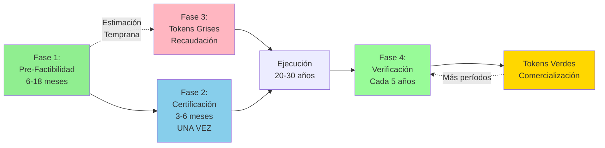
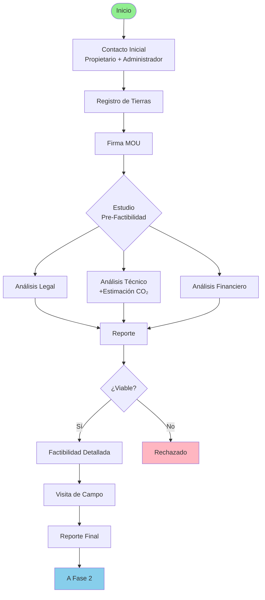
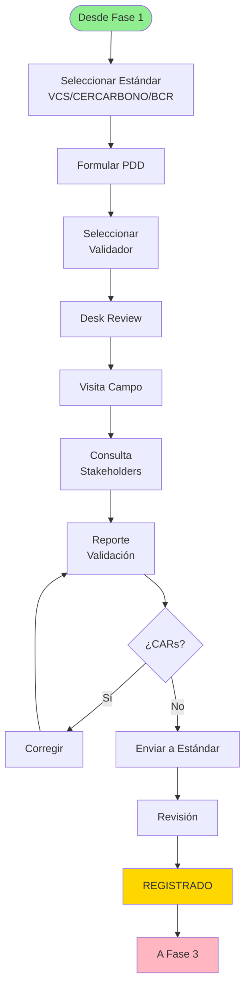
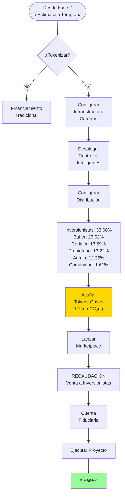
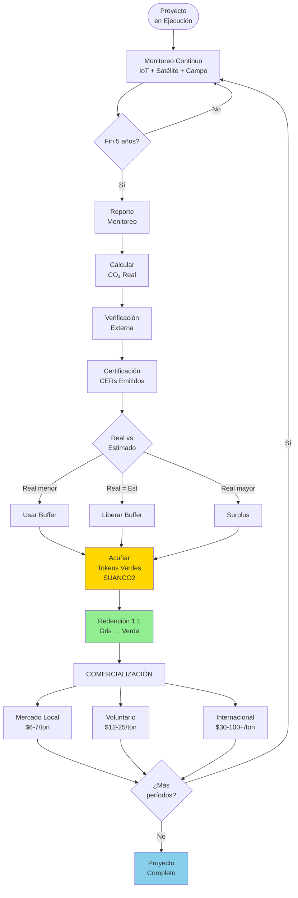
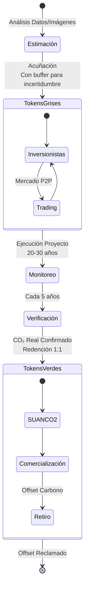

# Vista General del Proceso de Negocio (Con Diagramas Mermaid)

## Introducción

La plataforma Terrasacha facilita el ciclo de vida completo de proyectos de créditos de carbono—desde la evaluación inicial de tierras hasta la tokenización y comercialización final. Este flujo de trabajo integral integra procesos tradicionales del mercado de carbono con tecnología blockchain para crear activos digitales transparentes y comercializables que representan créditos de carbono verificados.

El proceso abarca **cuatro fases principales**. Es importante destacar que la **tokenización (tokens grises) puede iniciarse temprano** con estimaciones preliminares basadas en análisis de datos e imágenes, incluso antes de la certificación formal. Esto permite financiar el proceso de certificación mismo. La **certificación ocurre una sola vez**, mientras que la **verificación es periódica** (típicamente cada 5 años) para confirmar la retención real de CO₂ y convertir tokens grises a verdes en proporción 1:1.

##Flujo de Trabajo Completo

---

## Las Cuatro Fases

### Fase 1: Pre-Factibilidad (Registro y Estudios)

**Duración:** 6-18 meses

Se realiza una debida diligencia exhaustiva sobre proyectos potenciales de créditos de carbono. Durante esta fase, se pueden realizar **estimaciones tempranas** usando análisis de datos e imágenes para cuantificar el potencial de captura de carbono (con incertidumbre asociada).

**Resultado:** Determinación de viabilidad + estimación preliminar de créditos

---

### Fase 2: Certificación (PDD y Validación - Una Sola Vez)

**Duración:** 3-6 meses

El proyecto se certifica **una sola vez** mediante formulación de PDD, validación externa y registro con estándar de carbono.

**Resultado:** Proyecto certificado y registrado oficialmente

---

### Fase 3: Tokens Grises (Tokenización y Recaudación)

**Duración:** Puede iniciar temprano con estimaciones preliminares

Los tokens grises se acuñan basados en estimaciones tempranas para **financiar la certificación** y ejecución del proyecto.

**Resultado:** Proyecto financiado mediante tokens grises

---

### Fase 4: Tokens Verdes (Verificación Periódica y Comercio)

**Duración:** Continua con verificaciones cada ~5 años

Verificaciones periódicas confirman CO₂ real capturado, permitiendo conversión 1:1 de tokens grises a verdes.

**Resultado:** Créditos verificados como tokens verdes comercializables

---

## Ciclo de Vida de Tokens

---

## Resumen de Línea de Tiempo

| Fase | Duración Típica | Hito Clave |
|------|----------------|-----------|
| **Fase 1: Pre-Factibilidad** | 6-18 meses | Estimación Preliminar + Reporte de Factibilidad |
| **Fase 3: Tokens Grises** | Puede iniciar temprano | Acuñación con Estimaciones Tempranas |
| **Fase 2: Certificación** | 3-6 meses | Validación y Registro (Solo Una Vez) |
| **Ejecución Continua** | 20-30 años | Implementación y Monitoreo del Proyecto |
| **Fase 4 (Período 1)** | Año 5 | Primera Verificación → Tokens Verdes |
| **Fase 4 (Período 2)** | Año 10 | Segunda Verificación → Más Tokens Verdes |
| **Fase 4 (Período N)** | Cada 5 años | Verificaciones Periódicas Continuas |

**Innovación Clave:** Los tokens grises pueden lanzarse temprano (incluso antes de certificación completa) usando estimaciones preliminares, permitiendo financiar el proceso de certificación.

**Certificación vs. Verificación:**
- **Certificación:** Una sola vez al inicio (Fase 2)
- **Verificación:** Periódica cada 5 años (Fase 4) para conversión gris→verde 1:1

---

## Opciones de Idioma

Esta documentación está disponible en:

- [**English**](../en/index.md) - View documentation in English
- **Español** (actual)

---

**Nota:** Esta es una versión con diagramas Mermaid. Para la versión con SVG originales, ver [index.md](index.md)
