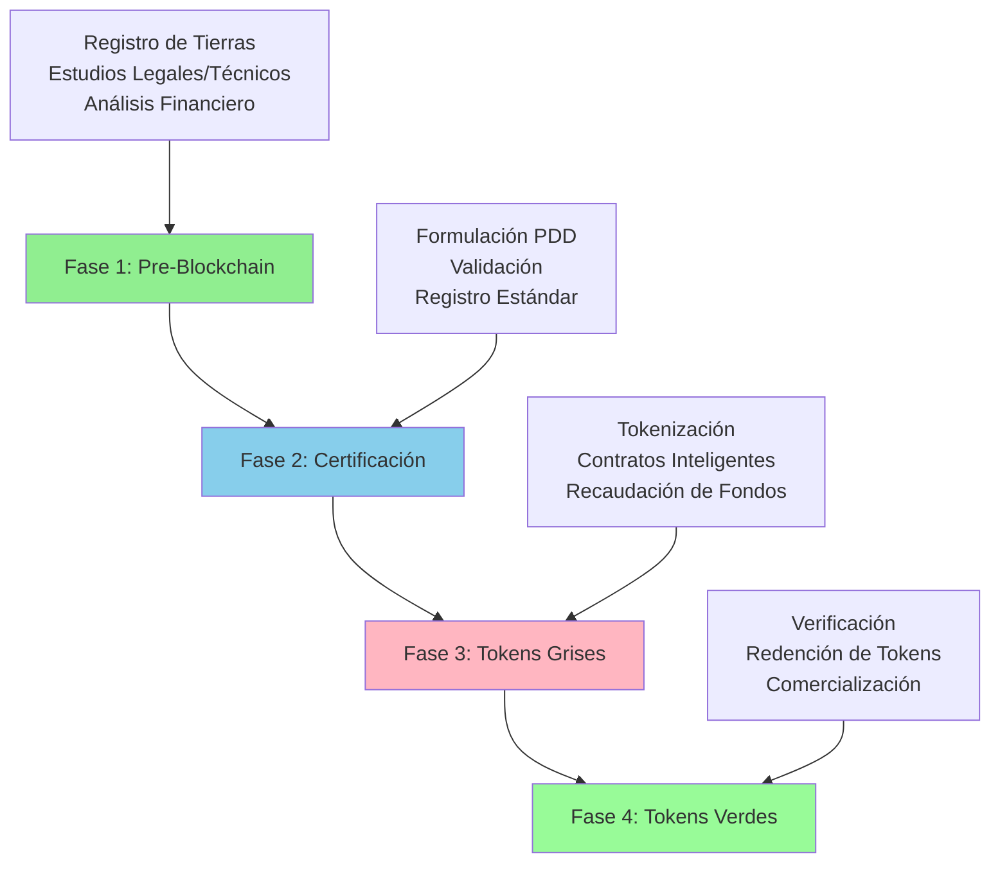

# Vista General del Proceso de Negocio

## Introducción

La plataforma Terrasacha facilita el ciclo de vida completo de proyectos de créditos de carbono—desde la evaluación inicial de tierras hasta la tokenización y comercialización final. Este flujo de trabajo integral considera procesos tradicionales del mercado de carbono con tecnología blockchain para crear activos digitales transparentes y comercializables que representan créditos de carbono verificados.

El proceso abarca **cuatro fases principales**, comenzando con extensas actividades pre-blockchain (debida diligencia legal, técnica y financiera) antes de la transición a la tokenización y comercio en cadena.

## Flujo de Trabajo Completo

## Las Cuatro Fases

### Fase 1: Pre-Blockchain (Registro y Estudios)
**Duración:** 6-18 meses

**Qué Sucede:** Antes de involucrar cualquier tecnología blockchain, se realiza una debida diligencia exhaustiva sobre proyectos potenciales de créditos de carbono. Esto incluye registro de tierras, verificación legal de títulos, análisis técnico GIS, modelado financiero y estudios de viabilidad.

**Actividades Clave:**
- Contacto inicial y firma de MOU
- Estudio de pre-factibilidad (legal, técnico, financiero)
- Estudio de factibilidad detallado con visitas de campo
- Análisis de suelos y silvicultura

**Resultado:** Determinación de la viabilidad del proyecto y preparación para formulación de PDD

[Más información sobre Fase 1 →](fase1-pre-blockchain.md)

---

### Fase 2: Certificación (PDD y Validación)
**Duración:** 3-6 meses
**Qué Sucede:** El documento de diseño del proyecto (PDD) se formula según un estándar de carbono elegido (VCS, CERCARBONO, BCR, etc.), luego es validado por una organización tercera acreditada y finalmente registrado con el organismo del estándar de carbono.

**Actividades Clave:**
- Selección del estándar de carbono
- Creación del documento PDD
- Auditoría de validación externa
- Registro con el estándar

**Resultado:** Proyecto de créditos de carbono registrado con proyecciones de créditos estimados

[Más información sobre Fase 2 →](fase2-certificacion.md)

---

### Fase 3: Tokens Grises (Tokenización y Recaudación)
**Duración:** 2-4 meses para configuración, continua para recaudación
**Qué Sucede:** El proyecto entra en la fase blockchain. Se despliegan contratos inteligentes y se acuñan tokens grises que representan créditos de carbono estimados (aún no certificados). Estos tokens se distribuyen entre los stakeholders y se venden a inversionistas para financiar el proyecto.

**Actividades Clave:**
- Configuración de cuentas de administrador y contratos
- Despliegue de contratos inteligentes
- Acuñación de tokens grises (1 token = 1 tonelada estimada CO₂eq)
- Distribución de tokens a stakeholders
- Recaudación de fondos de inversionistas mediante venta de tokens
- Gestión de cuentas fiduciarias

**Resultado:** Proyecto financiado, tokens grises en circulación, ejecución puede comenzar

[Más información sobre Fase 3 →](fase3-tokens-grises.md)

---

### Fase 4: Tokens Verdes (Verificación y Comercio)
**Duración:** Continua en períodos de verificación de 5 años
**Qué Sucede:** A medida que el proyecto se ejecuta y captura/reduce carbono, se recopilan datos de monitoreo. Cada período de verificación (típicamente 5 años), los resultados reales son verificados por terceros y se emiten créditos certificados. Los poseedores de tokens grises pueden redimirlos por tokens verdes que representan créditos certificados, que luego pueden comercializarse en mercados de carbono.

**Actividades Clave:**
- Monitoreo continuo (IoT, satélites, visitas de campo)
- Verificación periódica (cada 5 años)
- Certificación por el estándar de carbono
- Redención de tokens grises por tokens verdes
- Gestión del buffer pool
- Comercialización de créditos de carbono (mercados locales, voluntarios, internacionales)

**Resultado:** Créditos de carbono certificados como activos digitales comercializables

[Más información sobre Fase 4 →](fase4-tokens-verdes.md)

---

## Diagramas Visuales del Proceso

A continuación se presentan diagramas de flujo detallados para cada fase:

### Fase 1: Registro en la Plataforma
<figure markdown>
  
  <figcaption>Flujo completo de registro y estudio de pre-factibilidad</figcaption>
</figure>

### Fase 2: Certificación en la Plataforma
<figure markdown>
  
  <figcaption>Formulación de PDD, validación y proceso de registro con estándar</figcaption>
</figure>

### Fase 3: Mercado de Tokens Grises
<figure markdown>
  
  <figcaption>Tokenización, despliegue de contratos inteligentes y flujo de recaudación</figcaption>
</figure>

### Fase 4: Mercado de Tokens Verdes
<figure markdown>
  
  <figcaption>Verificación, certificación, redención y flujo de comercialización</figcaption>
</figure>

---

## Stakeholders Clave

El proceso completo involucra numerosos actores en diferentes fases:

### Fase Pre-Blockchain
- **Propietarios de Tierras** - Proveen tierras como garantía para proyectos de carbono
- **Administrador (SUAN)** - Operador de plataforma y coordinador de procesos
- **Equipo Legal** - Verificación de títulos, cumplimiento regulatorio
- **Equipo Técnico** - Análisis forestal, GIS y ambiental
- **Equipo Financiero** - Modelado económico y planificación de inversiones
- **Equipo Social** - Relaciones comunitarias y evaluación de impacto
- **Organizaciones de Validación** - Auditores terceros acreditados ISO
- **Organismos de Estándares de Carbono** - VCS, CERCARBONO, BCR, etc.

### Fase Blockchain
- **Inversionistas** - Compradores de tokens grises para financiar proyectos
- **Contratos Inteligentes** - Administradores autónomos de fondos
- **Comunidad** - Stakeholders locales que reciben beneficios
- **Certificadores** - Organizaciones que reciben asignación de tokens

### Fase de Comercialización
- **Organizaciones de Verificación** - Auditores terceros para resultados reales
- **Compradores de Créditos de Carbono** - Corporaciones, gobiernos, individuos
- **Comerciantes de Carbono** - Intermediarios del mercado
- **Entidades Regulatorias** - Autoridades fiscales, entidades de cumplimiento

[Ver matriz detallada de stakeholders →](../../reference/stakeholders.md)

---

## Resumen de Línea de Tiempo

Un proyecto típico de créditos de carbono sigue esta línea de tiempo:

| Fase | Duración Típica | Hito Clave |
|------|----------------|-----------|
| **Fase 1** | 6-18 meses | Reporte de Factibilidad Aprobado |
| **Fase 2** | 3-6 meses | Proyecto Registrado con Estándar |
| **Fase 3** | 2-4 meses | Tokens Grises Acuñados y Distribuidos |
| **Continua** | 20-30 años | Ejecución del Proyecto |
| **Fase 4 (Período 1)** | 5 años | Primera Verificación y Certificación |
| **Fase 4 (Período 2)** | 5 años | Segunda Verificación y Certificación |
| **Fase 4 (Período N)** | 5 años cada uno | Períodos de Verificación Subsiguientes |

**Tiempo Total Pre-Blockchain:** ~9-24 meses
**Tiempo hasta Lanzamiento de Tokens:** ~11-26 meses
**Primeros Tokens Verdes:** ~5 años después del inicio de ejecución del proyecto

[Ver línea de tiempo detallada →](../../reference/timeline.md)

---

## Involucramiento de Contratos Inteligentes

Los contratos inteligentes blockchain están **activos solo durante las Fases 3 y 4**. Antes de eso, todas las actividades son procesos tradicionales del mercado de carbono.

**Contratos Clave:**
- **Contrato de Acuñación Genesis** - Creación inicial de tokens grises
- **Contrato de Inversionistas** - Gestiona asignaciones de tokens de inversionistas
- **Contrato de Administrador** - Asignaciones del operador de plataforma
- **Contrato de Propietario** - Asignaciones del dueño de la tierra
- **Contrato de Comunidad** - Asignaciones de stakeholders locales
- **Contrato de Buffer** - Gestión de tokens del buffer de riesgo
- **Contrato de Swap** - Redención de tokens grises por verdes
- **Contrato de Acuñación/Quema SUANCO2** - Ciclo de vida de tokens verdes

[Más sobre arquitectura de contratos →](../../architecture/overview.md)

---

## Economía de Tokens

### Tokens Grises (No Certificados)
- Acuñados basados en créditos de carbono **estimados** del PDD
- Ratio: **1 token = 1 tonelada estimada CO₂eq**
- Distribuidos entre stakeholders al lanzamiento del proyecto
- Usados para recaudación antes de certificación
- Tokens de propiedad/inversión con potencial de valor futuro

### Tokens Verdes (SUANCO2 - Certificados)
- Emitidos después de verificación y certificación
- Ratio: **1 token = 1 tonelada certificada de reducción CO₂eq**
- Redimibles por poseedores de tokens grises según distribución por período
- Respaldados por certificados reales de reducción de carbono
- Comercializables en mercados de carbono

### Tokens de Buffer
- Pool de gestión de riesgo (típicamente 20-30% del total)
- Cubre déficit si créditos reales < créditos estimados
- Liberados a stakeholders si reales ≥ estimados
- Pueden habilitar redención premium si reales > estimados

---

## Glosario de Términos Clave

- **PDD (Project Design Document)** - Descripción comprensiva del proyecto requerida por estándares de carbono
- **MRV (Monitoring, Reporting, Verification)** - Proceso de seguimiento de reducciones reales de carbono
- **VCS (Verified Carbon Standard)** - Estándar líder del mercado voluntario de carbono
- **CIF (Certificado de Incentivo Forestal)** - Certificado de incentivo forestal colombiano
- **PEMF (Plan de Establecimiento y Manejo Forestal)** - Plan de manejo forestal requerido en Colombia
- **Tokens Grises** - Tokens que representan créditos de carbono estimados, no certificados
- **Tokens Verdes (SUANCO2)** - Tokens que representan créditos de carbono certificados
- **Buffer** - Pool de riesgo para gestionar varianza entre créditos estimados y reales

[Ver glosario completo →](../../reference/glossary.md)

---

## Próximos Pasos

Elija una fase para explorar en detalle:

- [**Fase 1: Pre-Blockchain →**](fase1-pre-blockchain.md) - Aprenda sobre evaluación de tierras y estudios de factibilidad
- [**Fase 2: Certificación →**](fase2-certificacion.md) - Comprenda la formulación de PDD y validación
- [**Fase 3: Tokens Grises →**](fase3-tokens-grises.md) - Explore la tokenización y recaudación de fondos
- [**Fase 4: Tokens Verdes →**](fase4-tokens-verdes.md) - Descubra la verificación y comercialización

O explore materiales de referencia:

- [**Glosario →**](../../reference/glossary.md) - Términos técnicos y definiciones
- [**Stakeholders →**](../../reference/stakeholders.md) - Todos los actores y sus roles
- [**Línea de Tiempo →**](../../reference/timeline.md) - Línea de tiempo detallada del proyecto

---

## Opciones de Idioma

Esta documentación está disponible en:

- [**English**](../en/index.md) - View documentation in English
- **Español** (actual)

---

**Nota:** Para las fases individuales (Fase 1-4), consulte la versión en inglés o contacte al administrador para traducciones completas al español.
