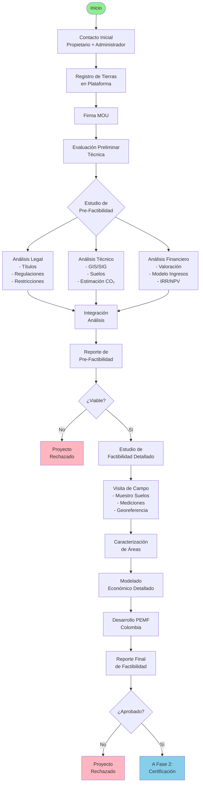
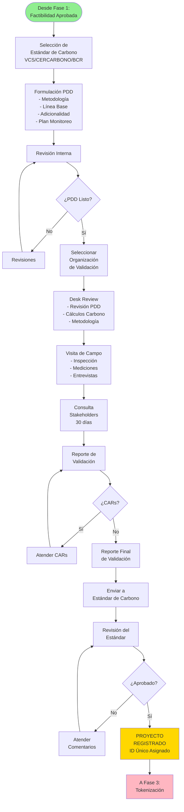
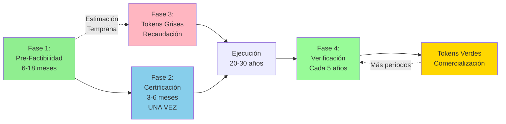
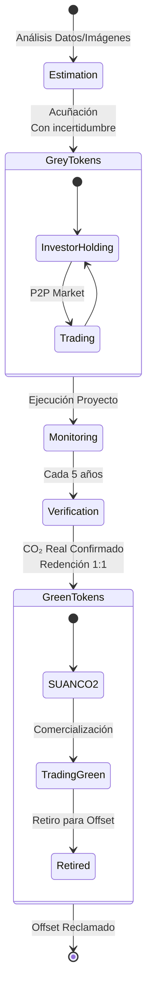

# Workflow Diagrams (Mermaid Version)

This document contains the Mermaid versions of all workflow diagrams. These can be used inline in documentation.

---

## Phase 1: Pre-Feasibility (Platform Registry)



---

## Phase 2: Certification (PDD & Validation)



---

## Phase 3: Grey Tokens (Tokenization & Fundraising)

```mermaid
flowchart TD
    FromPhase2([Desde Fase 2:<br/>Proyecto Registrado]) --> EarlyEst{Estimación Temprana<br/>Análisis Datos/Imágenes<br/>Puede iniciar antes<br/>de certificación}

    EarlyEst --> TokenDecision[Decisión de<br/>Tokenización<br/>Propietario]

    TokenDecision --> Accept{¿Acepta<br/>Términos?}
    Accept -->|No| Traditional[Financiamiento<br/>Tradicional]
    Accept -->|Sí| AdminSetup[Configuración Cuentas<br/>Administrador<br/>Cardano Wallets]

    AdminSetup --> SmartContracts[Despliegue de<br/>Contratos Inteligentes<br/>OpShin/Cardano]

    SmartContracts --> ContractList[Contratos:<br/>- Genesis Minting<br/>- Investor<br/>- Admin<br/>- Owner<br/>- Community<br/>- Certifier<br/>- Buffer<br/>- Swap]

    ContractList --> TokenDist[Configuración<br/>Distribución]

    TokenDist --> DistTable[Ejemplo Distribución:<br/>Inversionistas: 33.60%<br/>Buffer: 25.62%<br/>Certifier: 13.59%<br/>Propietario: 13.22%<br/>Admin: 12.35%<br/>Comunidad: 1.61%]

    DistTable --> GreyMint[Acuñación<br/>Tokens Grises<br/>1 token = 1 ton CO₂eq estimada]

    GreyMint --> DistTokens[Distribución a<br/>Contratos de Stakeholders]

    DistTokens --> Marketplace[Lanzamiento<br/>Marketplace]

    Marketplace --> InvestPlans[Planes de Inversión:<br/>- Early Bird<br/>- Standard<br/>- Flexible<br/>Diferentes precios/lock-ups]

    InvestPlans --> Fundraising[RECAUDACIÓN<br/>Venta Tokens Grises<br/>a Inversionistas]

    Fundraising --> P2P[Mercado P2P<br/>Trading Secundario]

    P2P --> FinClosure[Cierre Financiero<br/>Capital Recaudado]

    FinClosure --> Fiduciary[Cuenta Fiduciaria<br/>Gestión de Fondos]

    Fiduciary --> ProjectExec[EJECUCIÓN<br/>DEL PROYECTO<br/>Capital disponible]

    ProjectExec --> ToPhase4[A Fase 4:<br/>Monitoreo y<br/>Verificación]

    style FromPhase2 fill:#87CEEB
    style GreyMint fill:#FFD700
    style ToPhase4 fill:#98FB98
    style Traditional fill:#D3D3D3
```



---

## Phase 4: Green Tokens (Verification & Trading)

```mermaid
flowchart TD
    FromPhase3([Desde Fase 3:<br/>Proyecto en Ejecución]) --> Implementation[Implementación:<br/>- Plantación/Conservación<br/>- Infraestructura<br/>- Actividades de Proyecto]

    Implementation --> MonitorDeploy[Despliegue Sistema<br/>de Monitoreo]

    MonitorDeploy --> MonSystems[Sistemas:<br/>- IoT Sensors<br/>- Imágenes Satelitales<br/>- Mediciones Campo]

    MonSystems --> ContMon[Monitoreo Continuo<br/>Años 1-5]

    ContMon --> Period{Fin de Período?<br/>Típicamente 5 años}
    Period -->|No| ContMon
    Period -->|Sí| MonReport[Preparación<br/>Reporte de Monitoreo<br/>Cálculo CO₂ Real]

    MonReport --> CalcActual[Cálculo Créditos Reales:<br/>Biomasa medida<br/>- Fuga 15%<br/>- Incertidumbre 10%<br/>= Créditos Verificables]

    CalcActual --> SelectVerif[Seleccionar<br/>Organización<br/>de Verificación]

    SelectVerif --> VerifDesk[Desk Review<br/>Verificador]

    VerifDesk --> VerifSite[Visita de Campo<br/>Verificación]

    VerifSite --> VerifReport[Reporte de<br/>Verificación<br/>Créditos Confirmados]

    VerifReport --> StdCert[Estándar Emite<br/>Certificados CER<br/>IDs Únicos]

    StdCert --> CompareEst{Comparar:<br/>Estimado vs Real}

    CompareEst -->|Real < Est| UseBuffer[Usar Buffer Pool<br/>Cubrir déficit]
    CompareEst -->|Real = Est| ReleaseBuffer[Liberar Buffer<br/>a Stakeholders]
    CompareEst -->|Real > Est| Premium[Redención Premium<br/>Surplus distribuido]

    UseBuffer --> MintGreen[Acuñar Tokens Verdes<br/>SUANCO2]
    ReleaseBuffer --> MintGreen
    Premium --> MintGreen

    MintGreen --> LinkCerts[Vincular Certificados<br/>a Tokens<br/>Metadata On-Chain]

    LinkCerts --> Redemption[REDENCIÓN<br/>Tokens Grises → Verdes<br/>1:1 por período]

    Redemption --> InvestorSwap[Inversionistas<br/>Canjean Grises<br/>por Verdes]

    InvestorSwap --> Markets[COMERCIALIZACIÓN<br/>Tokens Verdes]

    Markets --> Local[Mercado Local<br/>Impuesto Carbono CO<br/>~$6-7/ton]
    Markets --> Voluntary[Mercado Voluntario<br/>Corporaciones<br/>$12-25/ton]
    Markets --> International[Mercados<br/>Internacionales<br/>$30-100+/ton]

    Local --> Retirement[Retiro de Tokens<br/>Reclamar Offset]
    Voluntary --> Retirement
    International --> Retirement

    Retirement --> MorePeriods{¿Más Períodos?}
    MorePeriods -->|Sí| ContMon2[Continuar Monitoreo<br/>Próximo Período 5 años]
    ContMon2 --> Period
    MorePeriods -->|No| ProjectComplete[Proyecto Completo<br/>Buffer Final Distribuido]

    style FromPhase3 fill:#FFB6C1
    style MintGreen fill:#FFD700
    style Redemption fill:#90EE90
    style ProjectComplete fill:#87CEEB
```



---

## Complete End-to-End Flow (Simplified)



---

## Token Lifecycle



---

## Notes for Implementation

To use these Mermaid diagrams in your documentation:

1. **Replace SVG figure blocks** with Mermaid code blocks
2. **Customize styling** using Mermaid theming if needed
3. **Add interactivity** - Mermaid supports click events
4. **Easy updates** - Text-based, version controlled
5. **Perfect scaling** - Renders at any size

### Example Usage:

```markdown
## Phase 1: Pre-Feasibility

\```mermaid
[paste the flowchart here]
\```

*Figure: Complete registration and pre-feasibility study workflow*
```

### Advantages over SVG:

- ✅ **Text-based** - Easy to edit and version control
- ✅ **Scalable** - Perfect rendering at any size
- ✅ **Maintainable** - Update text, not graphics
- ✅ **Accessible** - Better for screen readers
- ✅ **Consistent** - Styling via theme
- ✅ **No external files** - Embedded in markdown
