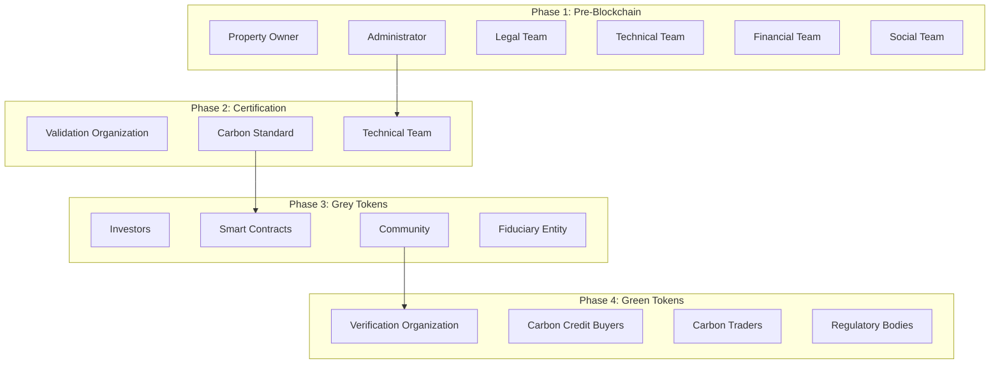

# Stakeholder Matrix

This document provides a comprehensive overview of all actors involved in the Terrasacha carbon credit project lifecycle, their roles, responsibilities, and involvement across different phases.

---

## Stakeholder Overview by Phase

---

## Complete Stakeholder List

### Primary Stakeholders

#### 1. Property Owner (Landowner)

**Role:** Provides land as the foundation for carbon credit generation

**Responsibilities:**
- Provide accurate property documentation
- Grant access for site visits and monitoring
- Maintain property boundaries and security
- Comply with project management requirements
- Participate in stakeholder consultations

**Rights:**
- Token allocation (typically 10-15%)
- Receive updates on project progress
- Participate in decision-making (if governance structure)
- Receive financial compensation per agreement

**Phase Involvement:**
- ✅ Phase 1: Initial registration, MOU signing, feasibility studies
- ✅ Phase 2: PDD formulation, validation support
- ✅ Phase 3: Tokenization decision, allocation agreement
- ✅ Phase 4: Project execution support, monitoring cooperation

---

#### 2. Administrator (SUAN Platform)

**Role:** Platform operator, project coordinator, and process manager

**Responsibilities:**
- Coordinate all project phases and stakeholders
- Manage smart contract deployment and operations
- Operate marketplace and trading platform
- Ensure compliance with standards and regulations
- Provide transparency and reporting to investors
- Manage fiduciary relationships
- Coordinate validation and verification processes

**Rights:**
- Token allocation (typically 10-15%)
- Platform operation fees
- Transaction fees from marketplace
- Decision-making authority for platform operations

**Phase Involvement:**
- ✅ Phase 1: All activities (coordinator)
- ✅ Phase 2: PDD support, standard liaison
- ✅ Phase 3: All tokenization activities (primary actor)
- ✅ Phase 4: Monitoring coordination, redemption management

---

#### 3. Investors (Grey Token Purchasers)

**Role:** Provide project financing through grey token purchases

**Responsibilities:**
- Conduct due diligence before investment
- Purchase grey tokens through platform
- Understand risk/reward profile
- Comply with KYC/AML requirements (if applicable)
- Hold tokens until redemption or trade on secondary market

**Rights:**
- Token allocation (typically 30-40%)
- Right to redeem grey tokens for green tokens
- Trade tokens on secondary market
- Access to project monitoring data and updates
- Receive fiduciary reports
- Vote on key decisions (if governance enabled)

**Types of Investors:**
- Impact investors (ESG focus)
- Carbon credit buyers (future offset needs)
- Blockchain/crypto investors
- Local Colombian investors
- Institutional investors

**Phase Involvement:**
- ❌ Phase 1: Not involved
- ❌ Phase 2: Not involved
- ✅ Phase 3: Primary actors (fundraising phase)
- ✅ Phase 4: Token redemption, green token trading

---

#### 4. Community (Local Stakeholders)

**Role:** Local community members affected by or benefiting from the project

**Responsibilities:**
- Participate in stakeholder consultations
- Provide local knowledge and feedback
- Support project activities (optional employment)
- Respect project boundaries and rules
- Engage in grievance mechanism if issues arise

**Rights:**
- Token allocation (typically 1-5%)
- Employment opportunities
- Community development benefits
- Participate in decision-making (FPIC if applicable)
- Access to grievance and redress mechanisms
- Transparent information about project

**Phase Involvement:**
- ✅ Phase 1: Consultation during feasibility studies
- ✅ Phase 2: Stakeholder consultation for validation
- ✅ Phase 3: Token allocation
- ✅ Phase 4: Ongoing benefits, verification consultation

---

#### 5. Certifier (BioC or similar entity)

**Role:** Entity receiving token allocation for certification-related services

**Responsibilities:**
- Potentially provide validation/verification services (or separate entity)
- Ensure quality and compliance
- Support carbon standard relationship

**Rights:**
- Token allocation (typically 10-15%)
- Fees for validation/verification services

**Phase Involvement:**
- ❌ Phase 1: Limited involvement
- ✅ Phase 2: Potentially validation
- ✅ Phase 3: Token allocation
- ✅ Phase 4: Potentially verification

**Note:** In some configurations, the certifier is simply a stakeholder receiving tokens, while validation/verification is performed by separate accredited organizations.

---

### Technical and Professional Service Providers

#### 6. Legal Team

**Role:** Ensure legal compliance and protect stakeholder interests

**Responsibilities:**
- Verify property titles and ownership
- Conduct legal due diligence
- Ensure regulatory compliance
- Draft contracts and agreements
- Advise on securities law (token classification)
- Manage intellectual property

**Expertise:**
- Property law
- Environmental law
- Colombian forestry regulations
- Blockchain/cryptocurrency regulations
- Securities law

**Phase Involvement:**
- ✅ Phase 1: Critical (legal analysis, compliance)
- ✅ Phase 2: PDD legal review, contract support
- ✅ Phase 3: Tokenization legal structure, investor agreements
- ⚠️ Phase 4: Ongoing compliance monitoring

---

#### 7. Technical Team

**Role:** Forestry, GIS, and environmental expertise

**Sub-Teams:**

**A. Foresters:**
- Species selection and silviculture
- Forest management planning
- Carbon estimation methodologies
- PEMF development (Colombia)

**B. GIS Specialists:**
- Spatial data analysis
- Restriction mapping
- Remote sensing analysis
- Monitoring system design

**C. Environmental Engineers:**
- Environmental impact assessment
- Biodiversity monitoring
- Conservation planning
- Ecosystem services valuation

**Phase Involvement:**
- ✅ Phase 1: Critical (technical feasibility)
- ✅ Phase 2: Critical (PDD formulation, carbon calculations)
- ✅ Phase 3: Monitoring system design
- ✅ Phase 4: Critical (ongoing monitoring, verification support)

---

#### 8. Financial Team

**Role:** Economic modeling and financial management

**Responsibilities:**
- Financial feasibility analysis
- Budget development and management
- Investment structuring
- Financial reporting
- Risk assessment
- Capital cost calculation

**Expertise:**
- Project finance
- Carbon market economics
- Financial modeling
- Risk management

**Phase Involvement:**
- ✅ Phase 1: Critical (financial feasibility)
- ✅ Phase 2: Financial components of PDD
- ✅ Phase 3: Investment plan design, pricing
- ✅ Phase 4: Financial reporting, ROI analysis

---

#### 9. Social Team

**Role:** Community relations and social impact

**Responsibilities:**
- Stakeholder mapping and analysis
- Community consultation facilitation
- Social impact assessment
- Benefit-sharing design
- Grievance mechanism management
- Cultural sensitivity and FPIC (if needed)

**Phase Involvement:**
- ✅ Phase 1: Social assessment during feasibility
- ✅ Phase 2: Stakeholder consultation for validation
- ✅ Phase 3: Community token allocation design
- ✅ Phase 4: Ongoing community relations

---

#### 10. Technology/Development Team

**Role:** Blockchain and platform development

**Responsibilities:**
- Smart contract development (OpShin)
- Marketplace platform development
- IoT monitoring system deployment
- Data management systems
- Cybersecurity
- User interface/experience design

**Expertise:**
- Cardano blockchain development
- Full-stack web development
- IoT systems
- Data science and analytics
- Cloud infrastructure

**Phase Involvement:**
- ❌ Phase 1: Not involved
- ❌ Phase 2: Limited (data systems)
- ✅ Phase 3: Critical (smart contracts, marketplace)
- ✅ Phase 4: Critical (monitoring systems, data platforms)

---

### Validation, Verification, and Standards Organizations

#### 11. Validation Organization

**Role:** Independent third-party validation of PDD before project registration

**Accreditation:** ISO/IEC 17029:2019

**Colombian Examples:**
- AENOR INTERNACIONAL
- ICONTEC
- VERSA EXPERTOS EN CERTIFICACIÓN
- VERIFIT COLOMBIA

**Responsibilities:**
- Review PDD for completeness and accuracy
- Conduct desk review and site visit
- Verify carbon calculations
- Conduct stakeholder consultations
- Issue validation report and opinion
- Submit report to carbon standard

**Phase Involvement:**
- ❌ Phase 1: Not involved
- ✅ Phase 2: Critical (validation process)
- ❌ Phase 3: Not involved (unless same entity for verification)
- ⚠️ Phase 4: Potentially verification (if selected)

---

#### 12. Verification Organization

**Role:** Independent third-party verification of actual carbon credits during project execution

**Accreditation:** ISO/IEC 17029:2019

**Responsibilities:**
- Review monitoring reports
- Verify carbon credit calculations for each period
- Conduct site visits to verify implementation
- Confirm monitoring data accuracy
- Issue verification report
- Submit report to carbon standard for credit issuance

**Phase Involvement:**
- ❌ Phase 1-3: Not involved
- ✅ Phase 4: Critical (periodic verification every ~5 years)

---

#### 13. Carbon Standard Organization

**Role:** Set requirements, register projects, and issue carbon credits

**Examples:**
- **VCS (Verra)** - Global voluntary standard
- **CERCARBONO** - Latin American focus
- **BioCarbon Registry** - Global
- **Gold Standard** - Premium sustainability
- **ColCx** - Colombian carbon tax

**Responsibilities:**
- Publish methodologies and requirements
- Review and approve validation reports
- Register projects and issue project IDs
- Review verification reports
- Issue carbon reduction certificates
- Maintain public registry
- Ensure integrity of carbon credits

**Phase Involvement:**
- ❌ Phase 1: Not involved
- ✅ Phase 2: Project registration, PDD approval
- ❌ Phase 3: Not involved (project already registered)
- ✅ Phase 4: Credit issuance after verification

---

### Carbon Market Actors

#### 14. Carbon Credit Buyers

**Role:** Purchase certified green tokens for carbon offsetting

**Types:**

**A. Compliance Buyers:**
- Companies with carbon tax obligations (Colombia)
- Entities in cap-and-trade systems (if eligible)

**B. Voluntary Buyers:**
- Corporations with net-zero commitments
- Carbon-neutral goal companies
- ESG-driven organizations
- Individuals offsetting footprint

**Responsibilities:**
- Conduct due diligence on carbon credits
- Purchase green tokens
- Retire tokens to claim carbon offset
- Report retirements in sustainability disclosures

**Phase Involvement:**
- ❌ Phase 1-3: Not involved
- ✅ Phase 4: Primary actors (commercialization)

---

#### 15. Carbon Traders and Intermediaries

**Role:** Facilitate carbon credit transactions between sellers and buyers

**Services:**
- Market-making and liquidity provision
- Price discovery
- Portfolio aggregation
- Risk management
- Regulatory navigation
- International market access

**Phase Involvement:**
- ❌ Phase 1-3: Not involved
- ✅ Phase 4: Secondary market facilitation

---

### Regulatory and Governmental Bodies

#### 16. Colombian Government Agencies

**Key Agencies:**

**A. DIAN (Tax Authority):**
- Administer carbon tax
- Accept carbon credits for tax offset
- Regulate tax compliance

**B. Ministry of Environment:**
- Environmental regulations
- Protected area management
- Climate policy

**C. Regional Environmental Authorities (CARs):**
- Environmental permits
- PEMF approval
- Local environmental oversight

**D. Ministry of Interior:**
- Indigenous community consultations
- Ethnic territory verification

**E. ICA (Agricultural Institute):**
- Plantation registration
- Forestry compliance

**Phase Involvement:**
- ✅ Phase 1: Regulatory compliance verification
- ✅ Phase 2: Permit approvals
- ⚠️ Phase 3-4: Ongoing compliance monitoring

---

#### 17. Financial Regulators

**Role:** Oversee financial aspects and potential securities regulation

**Agencies:**
- **Superintendencia Financiera (Colombia):** If tokens classified as securities
- **International:** Varies by investor jurisdiction

**Phase Involvement:**
- ❌ Phase 1-2: Not involved
- ✅ Phase 3: If tokens are securities
- ⚠️ Phase 4: Ongoing compliance

---

### Support Entities

#### 18. Fiduciary Entity

**Role:** Manage project funds and ensure proper disbursement

**Responsibilities:**
- Open and manage fiduciary accounts
- Review and validate expenditures
- Disburse funds per approved schedule
- Monitor financial compliance
- Generate financial reports
- Conduct audits

**Phase Involvement:**
- ❌ Phase 1-2: Not involved
- ✅ Phase 3: Fund management begins
- ✅ Phase 4: Ongoing fund administration

---

#### 19. Auditors (Financial and Technical)

**Role:** Independent verification of financial and operational integrity

**Types:**
- Financial auditors (annual statements)
- Technical auditors (monitoring systems)
- Smart contract auditors (code security)

**Phase Involvement:**
- ⚠️ Phase 1-2: Potentially for feasibility validation
- ✅ Phase 3: Smart contract audits
- ✅ Phase 4: Annual financial audits

---

## Stakeholder Matrix: Roles by Phase

| Stakeholder | Phase 1 | Phase 2 | Phase 3 | Phase 4 | Token Allocation |
|-------------|---------|---------|---------|---------|-----------------|
| **Property Owner** | ✅ Critical | ✅ Support | ✅ Allocation | ✅ Ongoing | 10-15% |
| **Administrator** | ✅ Critical | ✅ Critical | ✅ Critical | ✅ Critical | 10-15% |
| **Investors** | ❌ | ❌ | ✅ Critical | ✅ Critical | 30-40% |
| **Community** | ✅ Consultation | ✅ Consultation | ✅ Allocation | ✅ Benefits | 1-5% |
| **Certifier** | ❌ | ⚠️ Potential | ✅ Allocation | ⚠️ Potential | 10-15% |
| **Buffer Pool** | ❌ | ❌ | ✅ Created | ✅ Management | 20-30% |
| **Legal Team** | ✅ Critical | ✅ Support | ✅ Support | ⚠️ Compliance | Fees |
| **Technical Team** | ✅ Critical | ✅ Critical | ✅ Support | ✅ Critical | Fees |
| **Financial Team** | ✅ Critical | ✅ Support | ✅ Critical | ✅ Reporting | Fees |
| **Social Team** | ✅ Critical | ✅ Support | ✅ Support | ✅ Ongoing | Fees |
| **Tech Team** | ❌ | ❌ | ✅ Critical | ✅ Critical | Fees |
| **Validation Org** | ❌ | ✅ Critical | ❌ | ❌ | Fees |
| **Verification Org** | ❌ | ❌ | ❌ | ✅ Critical | Fees |
| **Carbon Standard** | ❌ | ✅ Critical | ❌ | ✅ Issuance | Fees |
| **Fiduciary** | ❌ | ❌ | ✅ Critical | ✅ Ongoing | Fees |
| **Carbon Buyers** | ❌ | ❌ | ❌ | ✅ Critical | N/A |
| **Regulators** | ✅ Compliance | ✅ Permits | ✅ Securities | ⚠️ Ongoing | N/A |

**Legend:**
- ✅ Critical: Essential involvement
- ✅ Support: Important support role
- ✅ Allocation: Receives token allocation
- ⚠️ Potential: May be involved depending on project specifics
- ❌ Not involved in this phase

---

## Governance and Decision-Making

### Key Decisions by Stakeholder

| Decision | Primary Decision Maker | Consultation Required |
|----------|----------------------|----------------------|
| **Proceed with tokenization** | Property Owner | Administrator |
| **Carbon standard selection** | Administrator | Technical, Financial teams |
| **Token distribution percentages** | Administrator + Property Owner | All stakeholders |
| **Investment plan design** | Administrator | Financial Team, Investors |
| **Redemption schedule** | Smart Contracts (predetermined) | N/A (automated) |
| **Buffer pool usage** | Smart Contracts (predetermined) | N/A (automated) |
| **Green token pricing** | Market (supply/demand) | N/A |

---

## Communication and Transparency

### Reporting Obligations

**Administrator Reporting To:**
- **Investors:** Monthly progress, quarterly financials, annual audited reports
- **Property Owner:** Quarterly project updates, token value updates
- **Community:** Biannual community meetings, annual benefit reports
- **Carbon Standard:** Annual monitoring reports, verification reports every ~5 years
- **Regulators:** As required by jurisdiction

**Public Transparency:**
- Carbon standard public registry (project details, credits issued)
- Blockchain transparency (all token transactions)
- Investor dashboard (real-time monitoring data)
- Community information sessions

---

## Conflict Resolution

### Grievance Mechanism

**Levels:**

1. **Direct Communication:** Stakeholder contacts administrator
2. **Formal Grievance:** Written complaint submitted
3. **Mediation:** Neutral third-party facilitator
4. **Arbitration:** Binding resolution (if in contracts)
5. **Legal Action:** Court proceedings (last resort)

**Common Conflicts:**
- Community concerns about project impacts
- Investor disputes over token allocation or redemption
- Property boundary disputes
- Monitoring data accuracy questions
- Benefit-sharing disagreements

---

## Additional Resources

- [Business Process Overview →](../business-process/en/index.md)
- [Glossary →](glossary.md)
- [Timeline →](timeline.md)

---

**Note:** Specific stakeholder roles and allocations may vary by project. This matrix represents typical configurations in Terrasacha carbon credit projects.
