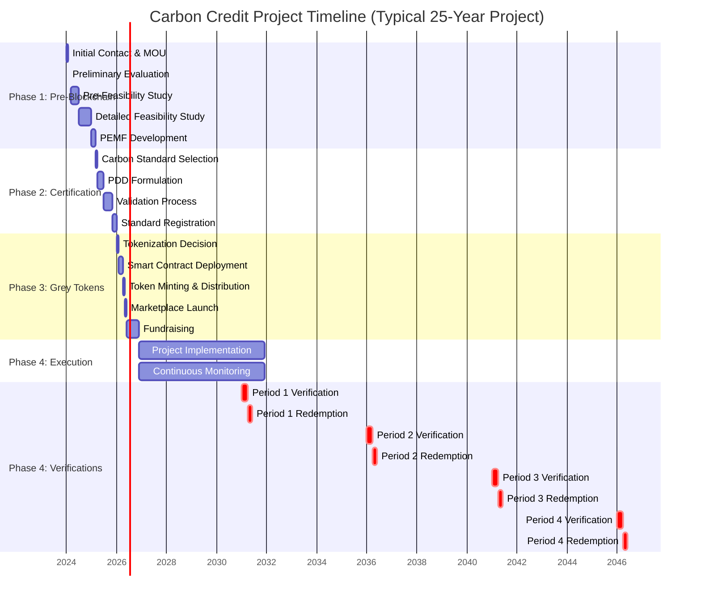

# Project Timeline

This document provides a comprehensive timeline for a typical Terrasacha carbon credit project from initial contact through multiple verification periods.

---

## Timeline Overview

---

## Detailed Timeline by Phase

### Year 0: Pre-Project Activities

#### Month 1: Initial Contact and Registration
**Activities:**
- First meeting between Administrator and Property Owner
- Project opportunity presentation
- Preliminary property information collection
- Data handling agreements

**Deliverables:**
- Initial property documentation
- Preliminary project scope

---

#### Month 1 (Week 3-4): MOU Signing
**Activities:**
- Memorandum of Understanding negotiation
- Terms and conditions agreement
- Confidentiality agreements
- Next steps definition

**Deliverables:**
- Signed MOU
- Feasibility study scope of work

---

#### Months 1-2: Preliminary Technical Evaluation
**Activities:**
- Quick desktop assessment
- Basic land eligibility check
- Preliminary document review
- Go/No-Go decision

**Deliverables:**
- Preliminary assessment report
- Feasibility study approval

**Decision Gate:** Proceed to full pre-feasibility study?

---

#### Months 2-6: Pre-Feasibility Study
**Parallel Work Streams:**

**Legal Analysis (Months 2-4):**
- Title verification
- Certificate of tradition study
- Land use certificates
- Legal restrictions assessment
- Regulatory compliance review

**Technical Analysis (Months 2-5):**
- GIS multi-layer analysis
- Soil aptitude verification (SIPRA)
- Forest potential assessment
- Preliminary carbon estimation
- Technology restrictions mapping

**Financial Analysis (Months 3-6):**
- Asset valuation
- Revenue model projection
- Cost estimation
- Liquidity analysis
- Market demand assessment
- Preliminary IRR/NPV calculation

**Deliverable:**
- Integrated Pre-Feasibility Report (Month 6)

**Decision Gate:** Viable project? Proceed to detailed feasibility?

---

#### Months 7-12: Detailed Feasibility Study
**Month 7: Field Visit Preparation**
- Team mobilization
- Equipment preparation
- Community liaison
- Logistics planning

**Months 7-8: Field Visit (1-2 weeks on-site)**
- Property boundary verification
- Soil sampling (multiple points)
- Forest plot measurements
- Georeferencing
- Infrastructure assessment
- Community consultations

**Months 8-10: Detailed Analyses**
- Forest inventory processing
- Area characterization and GIS mapping
- DOFA analysis
- Detailed legal due diligence
- Social assessment compilation

**Months 10-12: Economic Feasibility**
- Itemized project costs
- Unit price analysis (APU)
- 20-30 year cash flow projections
- Financial metrics (IRR, NPV, Cost/Benefit)
- Capital structure design
- Risk assessment matrix

**Deliverable:**
- Final Feasibility Report (Month 12)

**Decision Gate:** Approved for PDD formulation?

---

#### Months 13-14: PEMF Development (Colombia)
**Activities (if required):**
- Forestry management plan formulation
- Species selection finalization
- Silvicultural approach documentation
- Regional environmental authority submission

**Deliverable:**
- Approved PEMF

---

### Year 1-2: Certification Phase (Phase 2)

#### Month 15: Carbon Standard Selection
**Activities:**
- Evaluate standard options (VCS, CERCARBONO, BCR, etc.)
- Cost-benefit analysis by standard
- Target market consideration
- Final standard selection

**Deliverable:**
- Selected carbon standard with rationale

---

#### Months 16-18: PDD Formulation
**Activities:**
- Data compilation from feasibility studies
- Methodology application
- Carbon baseline and project scenarios
- Additionality demonstration
- Leakage assessment
- Monitoring plan design
- Document drafting and internal review

**Deliverable:**
- Complete PDD ready for validation (Month 18)

---

#### Month 19: Validation Organization Selection
**Activities:**
- Identify accredited validation organizations
- Request proposals
- Select validator
- Contract signing

**Deliverable:**
- Signed validation contract

---

#### Months 19-22: Validation Process
**Month 19-20: Desk Review**
- PDD completeness check
- Methodology compliance verification
- Carbon calculation review
- Clarification Requests (CRs) issued

**Month 20: Site Visit (1 week)**
- Field inspection
- Sample plot measurements
- Infrastructure verification
- Stakeholder consultations

**Month 20-21: Stakeholder Consultation**
- Public comment period (30 days)
- Community meetings
- Feedback compilation

**Month 21-22: Validation Report Development**
- Corrective Action Requests (CARs) issuance
- Project responses to CARs
- Iterative resolution
- Final validation report

**Deliverable:**
- Positive Validation Report (Month 22)

---

#### Months 23-24: Standard Registration
**Activities:**
- Submit validation package to standard
- Standard completeness review
- Potential additional public comment period
- Standard approval
- Project registration and ID issuance

**Deliverable:**
- Registered Carbon Credit Project with unique project ID (Month 24)

**Milestone:** Ready for tokenization!

---

### Year 2: Tokenization and Fundraising (Phase 3)

#### Month 25: Tokenization Decision
**Activities:**
- Property owner reviews tokenization terms
- Token distribution negotiation
- Legal structure finalization
- Tokenization agreement signing

**Deliverable:**
- Signed tokenization agreement

---

#### Months 26-27: Infrastructure Setup
**Activities:**
- Administrator wallet creation (Cardano)
- Project-specific accounts setup
- Pricing services configuration
- Smart contract preparation

**Deliverable:**
- Configured blockchain infrastructure

---

#### Months 26-28: Smart Contract Development & Deployment
**Activities:**
- Smart contract coding (OpShin)
- Testnet deployment and testing
- Security audit
- Mainnet deployment
- Contract verification

**Contracts Deployed:**
- Genesis Minting Contract
- Investor Contract
- Administrator Contract
- Property Owner Contract
- Community Contract
- Certifier Contract
- Buffer Contract
- Swap Contract
- Marketplace Contracts

**Deliverable:**
- Live smart contracts on Cardano mainnet (Month 28)

---

#### Month 28: Token Distribution Configuration
**Activities:**
- Stakeholder allocation negotiation
- Vesting schedule configuration
- Lock-up period definitions
- Legal documentation

**Example Allocation:**
- Investors: 33.60%
- Buffer: 25.62%
- Certifier: 13.59%
- Property Owner: 13.22%
- Administrator: 12.35%
- Community: 1.61%

**Deliverable:**
- Configured token distribution

---

#### Month 29: Grey Token Minting
**Activities:**
- Pre-minting verification
- Minting transaction execution
- Token distribution to stakeholder contracts
- Blockchain verification

**Example:**
- PDD projection: 550,000 tons CO₂eq
- Grey tokens minted: 550,000
- Ratio: 1 token = 1 estimated ton CO₂eq

**Deliverable:**
- Minted and distributed grey tokens

---

#### Month 29-30: Marketplace Launch
**Activities:**
- Investment plan configuration (multiple risk/return profiles)
- Primary market setup
- Secondary market (P2P) launch
- KYC/AML integration
- User interface finalization
- Marketing campaign launch

**Deliverable:**
- Live marketplace for grey token trading (Month 30)

---

#### Months 30-36: Fundraising
**Activities:**
- Investor outreach and onboarding
- Token sales (primary market)
- Secondary market trading begins
- Regular investor communications
- Milestone updates

**Target:**
- Sell 70-80% of investor allocation
- Example: ~130,000 of 184,800 investor tokens sold

**Month 36: Financial Closure**
- Capital cost formalization
- Funding allocation finalized
- Fiduciary account setup
- Financial document signing

**Deliverable:**
- Project fully funded, ready for execution (Month 36 / Year 3)

---

### Years 3-7: Project Execution and Monitoring (Phase 4 - Period 1)

#### Year 3 (Months 37-48): Project Implementation Begins

**Months 37-40: Setup Phase**
- Land preparation
- Nursery establishment (if needed)
- Infrastructure development (roads, storage)
- Equipment procurement
- Staff hiring and training

**Months 40-42: Planting Season 1 (if afforestation)**
- Seedling production or procurement
- Planting activities (seasonal, e.g., rainy season)
- Initial maintenance (weeding, protection)

**Months 43-48: Early Establishment**
- Pest and disease monitoring
- Replanting (if mortality)
- Fire prevention measures
- Community engagement activities

---

#### Years 4-7 (Months 49-84): Ongoing Implementation and Monitoring

**Continuous Activities:**

**Project Management:**
- Annual planting campaigns (if multi-year establishment)
- Maintenance (weeding, fertilization, pruning)
- Protection (fire prevention, illegal logging prevention)
- Infrastructure maintenance
- Community programs

**Monitoring System Deployment (Year 3-4):**
- IoT sensor network installation
- Satellite imagery subscription setup
- Permanent sample plot establishment
- Baseline measurements

**Continuous Monitoring (Years 3-7):**
- **IoT Data:** Real-time sensor data collection
- **Satellite Imagery:** Monthly/quarterly remote sensing analysis
- **Field Measurements:** Annual dasometric measurements on permanent plots
- **Data Management:** Continuous data aggregation and quality control

**Investor Reporting:**
- Monthly: Progress updates, IoT dashboard access
- Quarterly: Financial reports from fiduciary
- Annual: Comprehensive project report with monitoring results

---

### Year 7-8: Period 1 Verification (Months 85-90)

#### Months 85-87: Monitoring Report Preparation
**Activities:**
- Compile 5 years of monitoring data
- Calculate carbon stock changes using allometric equations
- Apply leakage and uncertainty deductions
- Draft comprehensive monitoring report
- Internal review and quality control

**Example Calculation:**
- Baseline (Year 0): 10,000 tons CO₂eq
- Project (Year 5): 60,000 tons CO₂eq
- Net Change: +50,000 tons CO₂eq
- Minus Leakage (15%): -7,500 tons
- Minus Uncertainty (10%): -4,250 tons
- **Net Verified Credits (Period 1): 38,250 tons CO₂eq**
- Compare to PDD estimate: 50,000 tons (23.5% shortfall)

**Deliverable:**
- Monitoring Report for Period 1 (Month 87)

---

#### Month 87-88: Verification Organization Engagement
**Activities:**
- Select verification organization
- Contract signing
- Submit monitoring report
- Schedule site visit

---

#### Months 88-89: Verification Process
**Month 88: Desk Review**
- Verification team reviews monitoring report
- Recalculates carbon credits
- Issues Clarification Requests (CRs)

**Month 88 (1 week): Site Visit**
- Field verification of sample plots
- Independent measurements
- Stakeholder consultations
- Implementation verification

**Month 89: Verification Report Development**
- Draft verification report
- Corrective Action Requests (if needed)
- Project responses
- Final verification report

**Deliverable:**
- Positive Verification Report confirming 38,250 tons CO₂eq (Month 89)

---

#### Month 90: Certification by Carbon Standard
**Activities:**
- Submit verification report to standard
- Standard review process
- Potential public comment period (if required)
- Credit issuance decision

**Deliverable:**
- 38,250 Carbon Reduction Certificates (CERs) issued
- Unique serial numbers assigned
- Credits deposited in project account

---

### Year 8: Period 1 Redemption (Months 91-93)

#### Month 91: Buffer Pool Analysis
**Comparison:**
- Estimated (PDD): 50,000 tons
- Actual (Verified): 38,250 tons
- Shortfall: 11,750 tons

**Buffer Usage:**
- Use 11,750 buffer tokens to cover shortfall
- Total buffer: 140,910 tokens
- Remaining buffer: 129,160 tokens

---

#### Month 91-92: Green Token (SUANCO2) Minting
**Activities:**
- Administrator verifies certification
- Link carbon certificate IDs to blockchain metadata
- Execute SUANCO2 minting contract
- Create 50,000 SUANCO2 tokens (38,250 verified + 11,750 buffer)

**Token Characteristics:**
- 1 SUANCO2 = 1 certified ton CO₂eq
- Backed by unique carbon reduction certificates
- Vintage: 2026-2031 (Period 1)

**Deliverable:**
- 50,000 green tokens ready for redemption (Month 92)

---

#### Months 92-96: Grey to Green Token Redemption
**Activities:**
- Open redemption window (6-12 months)
- Investors initiate grey token swaps
- Smart contracts execute:
  - Lock/burn grey tokens
  - Transfer green tokens to investors
- Blockchain records all redemption events

**Example Investor Redemption:**
- Investor holds: 10,000 grey tokens
- Period 1 proportion: 13.28% (from PDD schedule)
- Redeemable: 1,328 grey tokens → 1,328 SUANCO2 tokens
- Investor retains: 8,672 grey tokens (for future periods)

---

#### Months 93+: Green Token Trading and Commercialization
**Markets:**

**1. Colombian Carbon Tax Market:**
- Price: ~$6-7/ton (near carbon tax rate)
- Buyers: Colombian companies with tax liability
- Process: Token retirement + registry transfer to DIAN

**2. Voluntary Carbon Market:**
- Price: $12-25/ton (varies by buyer, co-benefits)
- Buyers: Corporations, individuals
- Channels: Direct, marketplaces, OTC brokers

**3. International Markets (if eligible):**
- Price: $30-100+/ton
- Markets: EU ETS, California Cap-and-Trade, UK ETS (potential)

**Activities:**
- List SUANCO2 on Terrasacha marketplace
- Engage carbon traders for larger volumes
- Direct sales to corporate buyers
- Token retirements for carbon offset claims

---

### Years 8-12: Period 2 Preparation and Monitoring

**Continuous Monitoring:**
- Ongoing IoT data collection
- Annual field measurements
- Satellite imagery analysis
- Adaptive management based on Period 1 learnings

**Reporting:**
- Annual progress reports
- Buffer pool status updates
- Market price tracking for SUANCO2

---

### Year 12-13: Period 2 Verification (Months 145-150)

**Similar Process to Period 1:**

1. **Monitoring Report Preparation (Months 145-147)**
   - Compile Years 6-10 data
   - Calculate carbon stock changes
   - Example estimated credits: 120,000 tons CO₂eq

2. **Verification Process (Months 148-149)**
   - Desk review and site visit
   - Verification report

3. **Certification (Month 150)**
   - Carbon standard issues credits for actual verified amount
   - Example: Assume 115,000 tons verified (vs. 120,000 estimated)

4. **Redemption (Months 151-156)**
   - Use 5,000 buffer tokens (shortfall)
   - Mint 120,000 SUANCO2 tokens
   - Open redemption window
   - Investors redeem Period 2 allocation (~31.86% of their grey tokens)

---

### Year 17-18: Period 3 Verification

**Example:**
- Estimated: 180,000 tons CO₂eq
- Verified: [To be determined]
- Redemption: ~47.73% of remaining grey tokens

---

### Year 22-23: Period 4 Verification (Final Period)

**Example:**
- Estimated: 200,000 tons CO₂eq
- Verified: [To be determined]
- Redemption: Remaining grey tokens (100%)

---

### Year 23-25: Project Completion

#### Final Buffer Disposition

**Scenario A: Buffer Surplus (Actual ≥ Estimated)**
- Release remaining buffer tokens to all stakeholders proportionally
- Stakeholders receive bonus green tokens

**Scenario B: Buffer Exhausted (Actual < Estimated)**
- All buffer used to cover shortfalls across periods
- No bonus distribution

**Example Final Reconciliation:**
- Total Estimated (PDD): 550,000 tons CO₂eq
- Total Verified (Actual): 535,000 tons CO₂eq
- Total Buffer Used: 15,000 tokens
- Remaining Buffer Released: 125,910 tokens → Distributed to stakeholders

---

#### Project Closure Activities

**Month 276-280:**
- Final verification report submitted
- All remaining green tokens minted and distributed
- Fiduciary account final report and closure
- Legal documentation archival
- Project legacy report

**Post-Crediting:**
- Ongoing monitoring (if required by standard for permanence)
- Option to renew crediting period (if standard allows)
- Long-term community engagement
- Biodiversity and ecosystem services continue

---

## Summary Timeline

| Milestone | Typical Timeframe | Cumulative Time |
|-----------|------------------|----------------|
| **Initial Contact** | Month 1 | 1 month |
| **MOU Signed** | Month 1 | 1 month |
| **Pre-Feasibility Complete** | Months 2-6 | 6 months |
| **Detailed Feasibility Complete** | Months 7-12 | 12 months |
| **PEMF Approved** | Months 13-14 | 14 months |
| **PDD Formulated** | Months 15-18 | 18 months |
| **Project Validated** | Months 19-22 | 22 months |
| **Project Registered** | Month 24 | **2 years** |
| **Grey Tokens Minted** | Month 29 | 29 months |
| **Fundraising Complete** | Month 36 | **3 years** |
| **Project Implementation Begins** | Month 37 | 3 years |
| **Period 1 Verification Complete** | Month 90 | **7.5 years** |
| **First Green Tokens Issued** | Month 92 | 7.7 years |
| **Period 2 Verification** | Month 150 | **12.5 years** |
| **Period 3 Verification** | Month 210 | **17.5 years** |
| **Period 4 Verification** | Month 270 | **22.5 years** |
| **Project Complete** | Month 280 | **23-25 years** |

---

## Critical Path and Dependencies

### Phase 1 → Phase 2 Dependency
**Cannot start PDD formulation until:**
- Feasibility study approved
- PEMF approved (if required)
- Technical data sufficient

### Phase 2 → Phase 3 Dependency
**Cannot mint grey tokens until:**
- Project registered with carbon standard
- Validated carbon projections available
- Tokenization agreement signed

### Phase 3 → Phase 4 Dependency
**Cannot execute project until:**
- Sufficient fundraising achieved (typically 70%+ of investor tokens sold)
- Fiduciary account established
- Smart contracts deployed and tested

### Verification Dependencies
**Cannot verify until:**
- Minimum crediting period completed (typically 5 years)
- Monitoring data collected and compiled
- Monitoring plan followed per PDD

### Redemption Dependencies
**Cannot redeem grey tokens until:**
- Verification completed for that period
- Carbon credits certified and issued by standard
- Green tokens minted with certificate linkage

---

## Risk Factors Affecting Timeline

### Potential Delays

| Risk | Potential Delay | Mitigation |
|------|---------------|-----------|
| **Legal issues (title disputes)** | 3-12 months | Thorough due diligence upfront |
| **Validation CARs (extensive)** | 2-4 months | High-quality PDD preparation |
| **Standard registration backlog** | 2-6 months | Early engagement with standard |
| **Fundraising shortfall** | 3-12 months | Attractive pricing, strong marketing |
| **Weather (field visit delays)** | 1-3 months | Flexible scheduling |
| **Regulatory changes** | Variable | Active compliance monitoring |
| **Verification issues** | 2-4 months | Robust monitoring QA/QC |

### Acceleration Opportunities

| Opportunity | Time Saved | Approach |
|-------------|-----------|----------|
| **Fast-track validation** | 1-2 months | Experienced validator, complete PDD |
| **Parallel activities** | 2-4 months | Overlap feasibility and PEMF |
| **Pre-developed smart contracts** | 1-2 months | Reuse audited contract templates |
| **Strong investor demand** | 2-6 months | Oversubscribed fundraising |

---

## Comparison: Traditional vs. Tokenized Projects

| Milestone | Traditional Carbon Project | Terrasacha Tokenized Project | Difference |
|-----------|--------------------------|----------------------------|-----------|
| **Feasibility to Registration** | 12-24 months | 12-24 months | Same (pre-blockchain) |
| **Fundraising** | 6-18 months | 3-6 months | **Faster** (token liquidity) |
| **Time to Project Start** | 2-4 years | 2.5-3.5 years | Comparable |
| **First Revenue** | 5-7 years (after verification) | 2.5 years (grey token sales) | **Much faster** |
| **Investor Liquidity** | None (illiquid until credit issuance) | Immediate (P2P trading) | **Major advantage** |
| **Total Project Duration** | 20-30 years | 20-30 years | Same |

---

## Additional Resources

- [Business Process Overview →](../business-process/en/index.md)
- [Phase-by-Phase Guides →](../business-process/en/index.md)
- [Stakeholder Matrix →](stakeholders.md)
- [Glossary →](glossary.md)

---

**Note:** Timelines are illustrative and based on typical projects. Actual timelines vary by project complexity, location, carbon standard, and market conditions.
